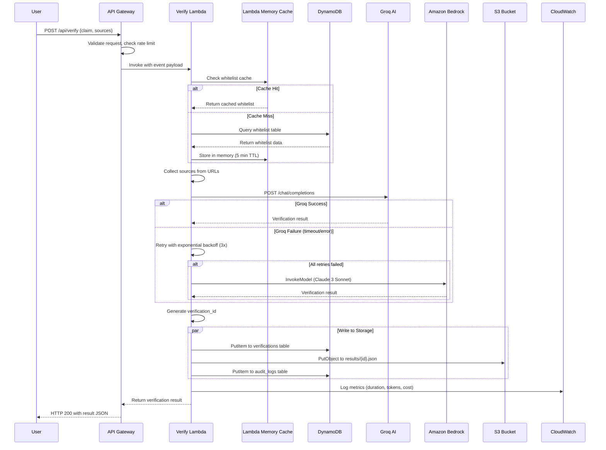
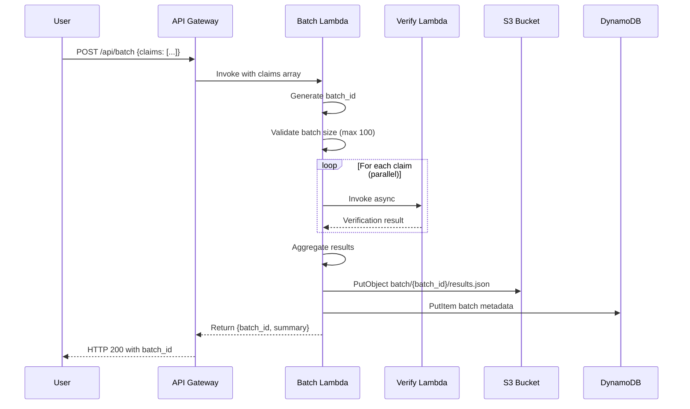
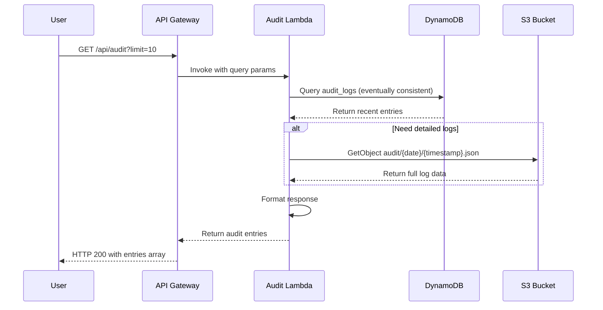
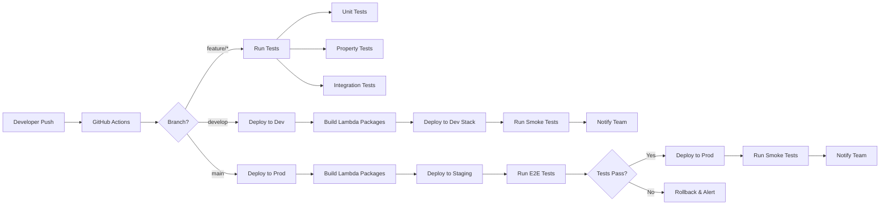

# Technical Design Document: AWS Integration for VeriGov AI

## Overview

This document provides a comprehensive technical design for migrating VeriGov AI from a local Flask application to a serverless AWS architecture. The design transforms the existing monolithic application into a distributed, scalable system using AWS Lambda, API Gateway, DynamoDB, S3, and Amazon Bedrock while maintaining all existing functionality and operating within a $50 AWS credit budget.

### Design Goals

1. **Serverless Architecture**: Eliminate persistent servers to achieve zero-cost scaling when idle
2. **Cost Optimization**: Operate within $50 AWS credit budget through careful resource selection and monitoring
3. **High Availability**: Leverage AWS managed services for 99.9%+ uptime
4. **Backward Compatibility**: Preserve all existing API endpoints and functionality
5. **Multi-Model AI**: Integrate Amazon Bedrock alongside Groq AI for redundancy and enhanced verification
6. **Security**: Implement least-privilege IAM policies and encryption at rest
7. **Observability**: Comprehensive logging, metrics, and billing alerts via CloudWatch
8. **Infrastructure as Code**: Fully automated deployment using CloudFormation and SAM

### Architecture Philosophy

The design follows AWS Well-Architected Framework principles:
- **Operational Excellence**: Infrastructure as code, automated deployments, comprehensive monitoring
- **Security**: Encryption, least privilege access, API authentication
- **Reliability**: Multi-AZ services, automatic retries, circuit breakers
- **Performance Efficiency**: Right-sized Lambda functions, caching, parallel processing
- **Cost Optimization**: On-demand billing, lifecycle policies, resource tagging


## Architecture

### High-Level Architecture Diagram

```mermaid
graph TB
    subgraph "Client Layer"
        Browser[Web Browser]
        CLI[CLI Client]
    end
    
    subgraph "AWS CloudFront CDN"
        CF[CloudFront Distribution]
    end
    
    subgraph "Frontend Hosting"
        S3Web[S3 Static Website<br/>index.html, style.css, script.js]
    end
    
    subgraph "API Layer"
        APIGW[API Gateway REST API<br/>CORS, Rate Limiting, API Keys]
    end
    
    subgraph "Compute Layer - Lambda Functions"
        VerifyLambda[Verify Lambda<br/>512MB, 30s timeout]
        AuditLambda[Audit Lambda<br/>256MB, 10s timeout]
        WhitelistLambda[Whitelist Lambda<br/>128MB, 5s timeout]
        BatchLambda[Batch Lambda<br/>1024MB, 300s timeout]
        HealthLambda[Health Lambda<br/>256MB, 5s timeout]
    end
    
    subgraph "AI Services"
        Groq[Groq AI<br/>Primary Provider]
        Bedrock[Amazon Bedrock<br/>Claude 3 Sonnet<br/>Fallback Provider]
    end
    
    subgraph "Storage Layer"
        DDB[DynamoDB Tables<br/>- audit_logs<br/>- verifications<br/>- whitelist<br/>On-Demand Billing]
        S3Data[S3 Data Bucket<br/>- audit/{date}/<br/>- results/{id}/<br/>- batch/{id}/<br/>Lifecycle: 90d → Glacier]
    end
    
    subgraph "Monitoring & Security"
        CW[CloudWatch<br/>Logs, Metrics, Alarms]
        SNS[SNS Topic<br/>Billing Alerts]
        IAM[IAM Roles<br/>Least Privilege]
    end
    
    Browser -->|HTTPS| CF
    CF -->|Cache Miss| S3Web
    Browser -->|API Calls| APIGW
    CLI -->|API Calls| APIGW
    
    APIGW -->|POST /api/verify| VerifyLambda
    APIGW -->|GET /api/audit| AuditLambda
    APIGW -->|GET /api/whitelist| WhitelistLambda
    APIGW -->|POST /api/batch| BatchLambda
    APIGW -->|GET /api/health| HealthLambda
    
    VerifyLambda -->|Primary| Groq
    VerifyLambda -->|Fallback| Bedrock
    VerifyLambda -->|Read/Write| DDB
    VerifyLambda -->|Write| S3Data
    
    BatchLambda -->|Parallel Invocations| VerifyLambda
    BatchLambda -->|Write Results| S3Data
    
    AuditLambda -->|Query| DDB
    AuditLambda -->|Read| S3Data
    
    WhitelistLambda -->|Read| DDB
    
    HealthLambda -->|Check| DDB
    HealthLambda -->|Check| S3Data
    HealthLambda -->|Check| Bedrock
    
    VerifyLambda -.->|Logs| CW
    AuditLambda -.->|Logs| CW
    WhitelistLambda -.->|Logs| CW
    BatchLambda -.->|Logs| CW
    HealthLambda -.->|Logs| CW
    
    CW -->|Billing Alert| SNS
    
    IAM -.->|Authorize| VerifyLambda
    IAM -.->|Authorize| AuditLambda
    IAM -.->|Authorize| WhitelistLambda
    IAM -.->|Authorize| BatchLambda
    IAM -.->|Authorize| HealthLambda
```

### Architecture Decisions

#### 1. Single-Table vs Multi-Table DynamoDB Design

**Decision**: Multi-table design with three tables (audit_logs, verifications, whitelist)

**Rationale**:
- Different access patterns: audit logs are time-series queries, verifications are key-value lookups, whitelist is reference data
- Simpler query patterns without complex GSIs
- Easier to implement lifecycle policies per table
- Lower complexity for a small-scale application
- Cost-effective with on-demand billing (no over-provisioning)

#### 2. Lambda Function Organization

**Decision**: Microservices approach with separate Lambda functions per endpoint

**Rationale**:
- Independent scaling: verify endpoint needs more resources than whitelist
- Isolated failures: error in one function doesn't affect others
- Granular IAM permissions: each function gets only required permissions
- Easier testing and deployment of individual functions
- Better cost attribution per function

#### 3. API Gateway: REST API vs HTTP API

**Decision**: REST API

**Rationale**:
- Supports API key authentication required for production (Requirement 6.9)
- Built-in request validation and transformation
- More mature feature set for enterprise use
- Supports usage plans for rate limiting (Requirement 1.11)
- Slightly higher cost but within budget constraints

#### 4. Bedrock Model Selection

**Decision**: Claude 3 Sonnet (anthropic.claude-3-sonnet-20240229-v1:0)

**Rationale**:
- Balance of performance and cost ($3 per 1M input tokens, $15 per 1M output tokens)
- Strong reasoning capabilities for fact verification
- 200K token context window for long documents
- Lower cost than Claude 3 Opus, better quality than Claude 3 Haiku
- Proven performance in similar verification tasks


#### 5. S3 Bucket Organization

**Decision**: Single bucket with prefix-based organization

**Rationale**:
- Simpler IAM policies and lifecycle management
- Lower cost (no per-bucket charges)
- Logical separation via prefixes: audit/, results/, batch/
- Easier to implement cross-prefix analytics
- Sufficient for application scale

#### 6. Caching Strategy

**Decision**: Multi-layer caching
- CloudFront edge caching for static assets (24 hours)
- Lambda in-memory caching for whitelist data (5 minutes)
- DynamoDB DAX not used (cost optimization)

**Rationale**:
- CloudFront dramatically reduces S3 GET requests for frontend
- Lambda memory caching reduces DynamoDB reads by ~90% for whitelist
- DAX adds $0.04/hour ($28.80/month) which exceeds budget
- Eventually consistent reads sufficient for audit queries

#### 7. Error Handling Strategy

**Decision**: Circuit breaker pattern with exponential backoff

**Rationale**:
- Prevents cascading failures when external services are down
- Exponential backoff reduces load on failing services
- Automatic fallback from Groq to Bedrock ensures availability
- Cached results provide degraded service during outages

### Data Flow Diagrams

#### Verification Request Flow



#### Batch Processing Flow



#### Audit Query Flow




## Components and Interfaces

### Lambda Functions

#### 1. Verify Lambda Function

**Purpose**: Process single claim verification requests

**Handler Signature**:
```python
def lambda_handler(event: dict, context: LambdaContext) -> dict:
    """
    Args:
        event: {
            "body": str,  # JSON string: {"claim": str, "sources": List[str]}
            "headers": dict,
            "requestContext": dict
        }
        context: Lambda context object
    
    Returns:
        {
            "statusCode": int,
            "headers": {"Content-Type": "application/json", "Access-Control-Allow-Origin": "*"},
            "body": str  # JSON string of verification result
        }
    """
```

**Event Structure**:
```json
{
  "body": "{\"claim\": \"The EPA was established in 1970\", \"sources\": [\"https://www.epa.gov/history\"]}",
  "headers": {
    "Content-Type": "application/json",
    "x-api-key": "api-key-value"
  },
  "requestContext": {
    "requestId": "request-id",
    "identity": {
      "sourceIp": "1.2.3.4"
    }
  }
}
```

**Response Format**:
```json
{
  "statusCode": 200,
  "headers": {
    "Content-Type": "application/json",
    "Access-Control-Allow-Origin": "*"
  },
  "body": "{\"verification_id\": \"uuid\", \"claim\": \"...\", \"status\": \"VERIFIED\", \"confidence\": 95, \"explanation\": \"...\", \"sources_checked\": 3, \"timestamp\": \"2024-01-15T10:30:00Z\"}"
}
```

**Configuration**:
- Memory: 512 MB
- Timeout: 30 seconds
- Environment Variables:
  - `GROQ_API_KEY`: Groq API authentication key
  - `AWS_REGION`: AWS region for Bedrock/DynamoDB/S3
  - `DYNAMODB_WHITELIST_TABLE`: Whitelist table name
  - `DYNAMODB_AUDIT_TABLE`: Audit log table name
  - `DYNAMODB_VERIFICATIONS_TABLE`: Verifications table name
  - `S3_BUCKET`: Data bucket name
  - `AI_PROVIDER`: "groq", "bedrock", or "multi"
  - `ENVIRONMENT`: "dev" or "prod"

**Dependencies**:
- boto3 (AWS SDK)
- groq (Groq AI SDK)
- requests (HTTP client for source collection)
- beautifulsoup4 (HTML parsing)

#### 2. Audit Lambda Function

**Purpose**: Query and retrieve audit log entries

**Handler Signature**:
```python
def lambda_handler(event: dict, context: LambdaContext) -> dict:
    """
    Args:
        event: {
            "queryStringParameters": {"limit": str, "start_date": str, "end_date": str},
            "headers": dict
        }
    
    Returns:
        {
            "statusCode": int,
            "headers": dict,
            "body": str  # JSON array of audit entries
        }
    """
```

**Response Format**:
```json
{
  "statusCode": 200,
  "headers": {
    "Content-Type": "application/json",
    "Access-Control-Allow-Origin": "*"
  },
  "body": "[{\"timestamp\": \"2024-01-15T10:30:00Z\", \"event_type\": \"VERIFICATION_REQUEST\", \"claim\": \"...\", \"status\": \"VERIFIED\"}]"
}
```

**Configuration**:
- Memory: 256 MB
- Timeout: 10 seconds
- Environment Variables: Same AWS resource names as Verify Lambda

#### 3. Whitelist Lambda Function

**Purpose**: Return approved government information sources

**Handler Signature**:
```python
def lambda_handler(event: dict, context: LambdaContext) -> dict:
    """
    Returns:
        {
            "statusCode": 200,
            "headers": dict,
            "body": str  # JSON: {"sources": List[dict]}
        }
    """
```

**Response Format**:
```json
{
  "statusCode": 200,
  "headers": {
    "Content-Type": "application/json",
    "Access-Control-Allow-Origin": "*"
  },
  "body": "{\"sources\": [{\"domain\": \"epa.gov\", \"name\": \"Environmental Protection Agency\", \"category\": \"environment\"}]}"
}
```

**Configuration**:
- Memory: 128 MB
- Timeout: 5 seconds
- Caching: In-memory cache with 5-minute TTL

#### 4. Batch Lambda Function

**Purpose**: Process multiple verification requests in parallel

**Handler Signature**:
```python
def lambda_handler(event: dict, context: LambdaContext) -> dict:
    """
    Args:
        event: {
            "body": str  # JSON: {"claims": List[str], "sources": List[str]}
        }
    
    Returns:
        {
            "statusCode": 200,
            "body": str  # JSON: {"batch_id": str, "total": int, "completed": int, "failed": int}
        }
    """
```

**Configuration**:
- Memory: 1024 MB
- Timeout: 300 seconds (5 minutes)
- Concurrency: Up to 10 parallel verify invocations
- Reserved Concurrency: 5 (to prevent runaway costs)

#### 5. Health Lambda Function

**Purpose**: Check system health and service connectivity

**Handler Signature**:
```python
def lambda_handler(event: dict, context: LambdaContext) -> dict:
    """
    Returns:
        {
            "statusCode": 200 or 503,
            "body": str  # JSON: {"status": "healthy", "services": {...}}
        }
    """
```

**Response Format**:
```json
{
  "statusCode": 200,
  "body": "{\"status\": \"healthy\", \"services\": {\"dynamodb\": \"ok\", \"s3\": \"ok\", \"bedrock\": \"ok\"}, \"timestamp\": \"2024-01-15T10:30:00Z\"}"
}
```

**Configuration**:
- Memory: 256 MB
- Timeout: 5 seconds

### API Gateway Configuration

#### REST API Definition

**API Name**: verigov-api-{environment}

**Endpoints**:

| Method | Path | Lambda Function | Auth | Rate Limit |
|--------|------|----------------|------|------------|
| POST | /api/verify | verify-lambda | API Key | 1000/min |
| GET | /api/audit | audit-lambda | API Key | 1000/min |
| GET | /api/whitelist | whitelist-lambda | None | 1000/min |
| POST | /api/batch | batch-lambda | API Key | 100/min |
| GET | /api/health | health-lambda | None | 100/min |
| OPTIONS | /api/* | Mock Integration | None | - |

**CORS Configuration**:
```json
{
  "Access-Control-Allow-Origin": "*",
  "Access-Control-Allow-Methods": "GET,POST,OPTIONS",
  "Access-Control-Allow-Headers": "Content-Type,X-Api-Key,Authorization",
  "Access-Control-Max-Age": "3600"
}
```

**Request Validation**:
- Verify endpoint: Validate JSON body with required "claim" field
- Batch endpoint: Validate claims array (max 100 items)
- Audit endpoint: Validate query parameters (limit: 1-1000)

**Usage Plan**:
```yaml
UsagePlan:
  Name: verigov-usage-plan
  Throttle:
    BurstLimit: 2000
    RateLimit: 1000  # requests per second
  Quota:
    Limit: 100000  # requests per month
    Period: MONTH
```

**API Key Management**:
- Development: Single API key for testing
- Production: Rotate keys every 90 days
- Key format: `verigov-{environment}-{random}`


## Data Models

### DynamoDB Schema Design

#### Table 1: audit_logs

**Purpose**: Store audit trail of all system activities

**Primary Key**:
- Partition Key: `timestamp` (String, ISO 8601 format: "2024-01-15T10:30:00.123Z")
- Sort Key: `event_type` (String: "VERIFICATION_REQUEST", "VERIFICATION_COMPLETE", "ERROR", etc.)

**Attributes**:
```python
{
    "timestamp": str,           # PK: ISO 8601 timestamp
    "event_type": str,          # SK: Event category
    "verification_id": str,     # UUID for correlation
    "claim": str,               # User-submitted claim
    "status": str,              # VERIFIED, FALSE, ERROR, etc.
    "confidence": int,          # 0-100
    "sources_checked": int,     # Number of sources verified
    "ai_provider": str,         # "groq" or "bedrock"
    "tokens_used": int,         # AI tokens consumed
    "duration_ms": int,         # Processing time
    "source_ip": str,           # Client IP address
    "error_message": str,       # Optional: error details
    "ttl": int                  # Optional: Unix timestamp for auto-deletion
}
```

**Global Secondary Indexes**:

GSI 1: `verification_id-index`
- Partition Key: `verification_id`
- Purpose: Query all events for a specific verification
- Projection: ALL

GSI 2: `event_type-timestamp-index`
- Partition Key: `event_type`
- Sort Key: `timestamp`
- Purpose: Query events by type in time order
- Projection: ALL

**Access Patterns**:
1. Get recent audit entries: Query by timestamp range (descending)
2. Get all events for verification: Query GSI 1 by verification_id
3. Get errors in time range: Query GSI 2 by event_type="ERROR" and timestamp range

**Billing Mode**: On-Demand (pay per request)

**Encryption**: AWS managed key (aws/dynamodb)

**Point-in-Time Recovery**: Enabled

**TTL**: Enabled on `ttl` attribute (optional auto-deletion after 1 year)

#### Table 2: verifications

**Purpose**: Store verification results for quick retrieval

**Primary Key**:
- Partition Key: `verification_id` (String, UUID)

**Attributes**:
```python
{
    "verification_id": str,     # PK: UUID
    "claim": str,               # Original claim text
    "status": str,              # VERIFIED, PARTIALLY_VERIFIED, FALSE, etc.
    "confidence": int,          # 0-100
    "explanation": str,         # AI-generated explanation
    "sources_checked": int,     # Number of sources
    "sources": List[dict],      # Source URLs and metadata
    "ai_provider": str,         # "groq" or "bedrock"
    "ai_model": str,            # Model identifier
    "tokens_used": int,         # Token count
    "timestamp": str,           # ISO 8601 creation time
    "s3_key": str,              # S3 location of full result
    "ttl": int                  # Optional: Unix timestamp for auto-deletion
}
```

**Global Secondary Indexes**:

GSI 1: `timestamp-index`
- Partition Key: `status`
- Sort Key: `timestamp`
- Purpose: Query verifications by status and time
- Projection: KEYS_ONLY (reduce storage cost)

**Access Patterns**:
1. Get verification by ID: GetItem by verification_id
2. Get recent verifications: Query GSI 1 by status and timestamp range
3. Get full result: GetItem then S3 GetObject using s3_key

**Billing Mode**: On-Demand

**Encryption**: AWS managed key

**Point-in-Time Recovery**: Enabled

#### Table 3: whitelist

**Purpose**: Store approved government information sources

**Primary Key**:
- Partition Key: `domain` (String: "epa.gov", "cdc.gov", etc.)

**Attributes**:
```python
{
    "domain": str,              # PK: Domain name
    "name": str,                # Human-readable name
    "category": str,            # "environment", "health", "education", etc.
    "description": str,         # Source description
    "reliability_score": int,   # 0-100
    "last_verified": str,       # ISO 8601 timestamp
    "active": bool,             # Enable/disable source
    "metadata": dict            # Additional source info
}
```

**Access Patterns**:
1. Get all active sources: Scan with filter active=true (cached in Lambda)
2. Get source by domain: GetItem by domain
3. Update source: UpdateItem by domain

**Billing Mode**: On-Demand

**Encryption**: AWS managed key

**Size**: ~50 items (minimal cost)

### S3 Bucket Structure

**Bucket Name**: verigov-data-{environment}-{account-id}

**Folder Hierarchy**:
```
verigov-data-prod-123456789012/
├── audit/
│   ├── 2024/
│   │   ├── 01/
│   │   │   ├── 15/
│   │   │   │   ├── 2024-01-15T10-30-00-123Z.json
│   │   │   │   ├── 2024-01-15T10-31-00-456Z.json
│   │   │   │   └── ...
│   │   │   └── 16/
│   │   └── 02/
│   └── ...
├── results/
│   ├── a1b2c3d4-e5f6-7890-abcd-ef1234567890.json
│   ├── b2c3d4e5-f6a7-8901-bcde-f12345678901.json
│   └── ...
└── batch/
    ├── batch-2024-01-15-001/
    │   ├── results.json
    │   └── metadata.json
    ├── batch-2024-01-15-002/
    └── ...
```

**Object Naming Conventions**:
- Audit logs: `audit/{YYYY}/{MM}/{DD}/{ISO8601-timestamp}.json`
- Verification results: `results/{verification_id}.json`
- Batch results: `batch/{batch_id}/results.json`

**Lifecycle Policies**:

```yaml
LifecycleConfiguration:
  Rules:
    - Id: archive-old-audit-logs
      Status: Enabled
      Prefix: audit/
      Transitions:
        - Days: 90
          StorageClass: GLACIER
      Expiration:
        Days: 365
    
    - Id: delete-old-batch-results
      Status: Enabled
      Prefix: batch/
      Expiration:
        Days: 30
    
    - Id: archive-old-verification-results
      Status: Enabled
      Prefix: results/
      Transitions:
        - Days: 180
          StorageClass: GLACIER
```

**Bucket Policies**:
```json
{
  "Version": "2012-10-17",
  "Statement": [
    {
      "Sid": "AllowLambdaWrite",
      "Effect": "Allow",
      "Principal": {
        "AWS": "arn:aws:iam::ACCOUNT:role/verigov-verify-lambda-role"
      },
      "Action": ["s3:PutObject", "s3:PutObjectAcl"],
      "Resource": "arn:aws:s3:::verigov-data-prod-ACCOUNT/*"
    },
    {
      "Sid": "AllowLambdaRead",
      "Effect": "Allow",
      "Principal": {
        "AWS": "arn:aws:iam::ACCOUNT:role/verigov-audit-lambda-role"
      },
      "Action": ["s3:GetObject"],
      "Resource": "arn:aws:s3:::verigov-data-prod-ACCOUNT/*"
    }
  ]
}
```

**Encryption**: AES-256 (SSE-S3)

**Versioning**: Enabled for audit/ prefix only

**Object Lock**: Not enabled (cost optimization)

### Bedrock Integration

#### Model Configuration

**Model ID**: `anthropic.claude-3-sonnet-20240229-v1:0`

**Inference Parameters**:
```python
{
    "modelId": "anthropic.claude-3-sonnet-20240229-v1:0",
    "contentType": "application/json",
    "accept": "application/json",
    "body": {
        "anthropic_version": "bedrock-2023-05-31",
        "max_tokens": 1000,
        "temperature": 0.3,  # Lower temperature for factual verification
        "top_p": 0.9,
        "messages": [
            {
                "role": "user",
                "content": "..."
            }
        ]
    }
}
```

**Prompt Template**:
```python
VERIFICATION_PROMPT = """You are a fact-checking assistant for government information verification.

Claim: {claim}

Sources:
{sources}

Task: Verify if the claim is accurate based on the provided government sources.

Respond in JSON format:
{{
  "status": "VERIFIED" | "PARTIALLY_VERIFIED" | "FALSE" | "UNVERIFIED",
  "confidence": 0-100,
  "explanation": "Detailed explanation of your verification",
  "supporting_evidence": ["quote 1", "quote 2"],
  "contradicting_evidence": ["quote 1", "quote 2"]
}}
"""
```

**Cost Estimation**:
- Input: ~500 tokens per request (claim + sources)
- Output: ~300 tokens per response
- Cost per request: (500 × $0.003 + 300 × $0.015) / 1000 = $0.006
- Budget allows: $50 / $0.006 = ~8,333 Bedrock verifications

**Fallback Logic**:
```python
def verify_with_ai(claim: str, sources: List[str]) -> dict:
    try:
        # Primary: Groq AI
        result = groq_client.verify(claim, sources)
        return result
    except (TimeoutError, APIError) as e:
        logger.warning(f"Groq failed: {e}, falling back to Bedrock")
        
        # Fallback: Amazon Bedrock
        try:
            result = bedrock_client.invoke_model(
                modelId="anthropic.claude-3-sonnet-20240229-v1:0",
                body=json.dumps({
                    "anthropic_version": "bedrock-2023-05-31",
                    "max_tokens": 1000,
                    "messages": [{"role": "user", "content": prompt}]
                })
            )
            return parse_bedrock_response(result)
        except Exception as bedrock_error:
            logger.error(f"Bedrock also failed: {bedrock_error}")
            raise VerificationError("All AI providers unavailable")
```


## Correctness Properties

A property is a characteristic or behavior that should hold true across all valid executions of a system—essentially, a formal statement about what the system should do. Properties serve as the bridge between human-readable specifications and machine-verifiable correctness guarantees.

### Property 1: API Endpoint Contract Compliance

For any valid verification request (claim with optional sources), the verify endpoint should return a properly structured verification result containing verification_id, status, confidence, explanation, and timestamp fields.

**Validates: Requirements 1.1**

### Property 2: CORS Headers Present

For any API request to any endpoint, the response should include Access-Control-Allow-Origin header to enable browser-based requests.

**Validates: Requirements 1.10**

### Property 3: DynamoDB Audit Log Key Structure

For any audit log entry written to DynamoDB, the item should have timestamp as partition key and event_type as sort key, both as non-empty strings.

**Validates: Requirements 2.1**

### Property 4: S3 Audit Log Path Pattern

For any audit log written to S3, the object key should match the pattern `audit/{YYYY}/{MM}/{DD}/{ISO8601-timestamp}.json` where the date components are extracted from the timestamp.

**Validates: Requirements 2.4**

### Property 5: Groq Primary Provider

For any verification request when AI_PROVIDER is "groq" or "multi", the system should attempt to call Groq AI before any other AI provider.

**Validates: Requirements 3.1**

### Property 6: Bedrock Fallback on Groq Failure

For any verification request, if Groq AI fails (timeout, error, or unavailable), the system should automatically invoke Amazon Bedrock Claude 3 Sonnet model as fallback.

**Validates: Requirements 3.2**

### Property 7: API Key Authentication in Production

For any API request to authenticated endpoints when ENVIRONMENT="prod", requests without a valid x-api-key header should be rejected with HTTP 403.

**Validates: Requirements 6.9**

### Property 8: Migration Timestamp Preservation

For any audit log entry migrated from local storage to DynamoDB, the timestamp in the migrated entry should exactly match the timestamp in the original entry (round-trip property).

**Validates: Requirements 8.1, 8.4**

### Property 9: Batch Size Validation

For any batch verification request with N claims where N ≤ 100, the request should be accepted and processed. For any batch with N > 100, the request should be rejected with HTTP 400 and error message indicating maximum batch size.

**Validates: Requirements 9.2, 9.10**

### Property 10: Health Check Service Status

For any health check request, the response should include connectivity status for DynamoDB, S3, and Bedrock services, each marked as "ok" or "error".

**Validates: Requirements 10.2, 10.3, 10.4**

### Property 11: Environment Variable Configuration

For any required environment variable (AWS_REGION, GROQ_API_KEY, STORAGE_MODE, AI_PROVIDER, ENVIRONMENT), if the variable is not set or empty, the system should fail to initialize and log a clear error message identifying the missing variable.

**Validates: Requirements 11.1, 11.9**

### Property 12: Whitelist Caching

For any two consecutive whitelist queries within 5 minutes, the second query should return cached data without making a DynamoDB request (verified by checking DynamoDB request count).

**Validates: Requirements 12.10**

### Property 13: Exponential Backoff Retry

For any Groq AI request that fails, the system should retry up to 3 times with exponential backoff delays (approximately 1s, 2s, 4s) before falling back to Bedrock.

**Validates: Requirements 13.1**

### Property 14: Circuit Breaker State Transitions

For any external API (Groq or Bedrock), after N consecutive failures (N=5), the circuit breaker should open and subsequent requests should immediately return cached results or error without attempting the API call. After a timeout period, the circuit breaker should transition to half-open and allow one test request.

**Validates: Requirements 13.8**

### Property 15: Input Validation Error Messages

For any invalid verification request (empty claim, malformed JSON, invalid sources), the system should return HTTP 400 with a JSON error response containing a specific validation error message describing what is invalid.

**Validates: Requirements 13.11**

### Property 16: Storage Mode Switching

For any verification request, when STORAGE_MODE="local", audit logs and results should be written to local files. When STORAGE_MODE="aws", they should be written to DynamoDB and S3. The system should not write to both when in single mode.

**Validates: Requirements 8.7, 8.8, 8.9**

### Property 17: Multi-Model Consensus

For any verification request when AI_PROVIDER="multi", both Groq and Bedrock should be invoked, and if both return the same status (VERIFIED, FALSE, etc.), the result should be marked as "consensus". If they disagree, the result should be flagged with "conflicting_models" indicator.

**Validates: Requirements 3.3, 3.4, 3.5**

### Property 18: Bedrock Model Configuration

For any Bedrock invocation, the request should specify model ID "anthropic.claude-3-sonnet-20240229-v1:0" and max_tokens parameter set to 1000.

**Validates: Requirements 3.6, 3.7**

### Property 19: AI Invocation Audit Logging

For any AI model invocation (Groq or Bedrock), an audit log entry should be created containing the model name, token count, and invocation timestamp.

**Validates: Requirements 3.8**

### Property 20: DynamoDB Consistency Mode

For any audit log query (non-critical read), the DynamoDB request should use eventually consistent reads (ConsistentRead=false) to reduce costs. For verification result queries (critical reads), the request should use strongly consistent reads (ConsistentRead=true).

**Validates: Requirements 12.2, 12.3**


## Error Handling

### Error Categories

#### 1. Client Errors (4xx)

**400 Bad Request**:
- Missing required fields (claim)
- Invalid JSON format
- Batch size exceeds 100 claims
- Invalid source URLs
- Malformed query parameters

Response format:
```json
{
  "error": "Bad Request",
  "message": "Claim is required",
  "details": {
    "field": "claim",
    "issue": "missing or empty"
  }
}
```

**403 Forbidden**:
- Missing API key in production
- Invalid API key
- Expired API key

Response format:
```json
{
  "error": "Forbidden",
  "message": "Valid API key required"
}
```

**429 Too Many Requests**:
- Rate limit exceeded (>1000 requests/minute)

Response format:
```json
{
  "error": "Too Many Requests",
  "message": "Rate limit exceeded",
  "retry_after": 60
}
```

#### 2. Server Errors (5xx)

**500 Internal Server Error**:
- Unhandled exceptions in Lambda
- Database write failures
- S3 upload failures

Response format:
```json
{
  "error": "Internal Server Error",
  "message": "An unexpected error occurred",
  "request_id": "abc-123-def"
}
```

**503 Service Unavailable**:
- All AI providers unavailable
- DynamoDB throttling after retries
- S3 service degradation
- Circuit breaker open

Response format:
```json
{
  "error": "Service Unavailable",
  "message": "AI verification service temporarily unavailable",
  "retry_after": 300
}
```

**504 Gateway Timeout**:
- Lambda function timeout (>30 seconds)
- AI provider timeout

Response format:
```json
{
  "error": "Gateway Timeout",
  "message": "Request processing exceeded time limit"
}
```

### Retry Strategies

#### Exponential Backoff Configuration

```python
class RetryConfig:
    """Retry configuration for different service types"""
    
    GROQ_AI = {
        "max_attempts": 3,
        "base_delay": 1.0,  # seconds
        "max_delay": 8.0,
        "exponential_base": 2,
        "jitter": True
    }
    
    BEDROCK = {
        "max_attempts": 3,
        "base_delay": 0.5,
        "max_delay": 4.0,
        "exponential_base": 2,
        "jitter": True
    }
    
    DYNAMODB = {
        "max_attempts": 5,
        "base_delay": 0.1,
        "max_delay": 2.0,
        "exponential_base": 2,
        "jitter": True
    }
    
    S3 = {
        "max_attempts": 3,
        "base_delay": 0.5,
        "max_delay": 4.0,
        "exponential_base": 2,
        "jitter": True
    }

def calculate_backoff_delay(attempt: int, config: dict) -> float:
    """Calculate delay with exponential backoff and jitter"""
    delay = min(
        config["base_delay"] * (config["exponential_base"] ** attempt),
        config["max_delay"]
    )
    
    if config["jitter"]:
        # Add random jitter (±25%)
        jitter = delay * 0.25 * (2 * random.random() - 1)
        delay += jitter
    
    return delay
```

#### Circuit Breaker Pattern

```python
class CircuitBreaker:
    """Circuit breaker for external service calls"""
    
    def __init__(self, failure_threshold: int = 5, timeout: int = 60):
        self.failure_threshold = failure_threshold
        self.timeout = timeout  # seconds
        self.failure_count = 0
        self.last_failure_time = None
        self.state = "CLOSED"  # CLOSED, OPEN, HALF_OPEN
    
    def call(self, func, *args, **kwargs):
        """Execute function with circuit breaker protection"""
        
        if self.state == "OPEN":
            if time.time() - self.last_failure_time > self.timeout:
                self.state = "HALF_OPEN"
                logger.info("Circuit breaker transitioning to HALF_OPEN")
            else:
                raise CircuitBreakerOpenError("Circuit breaker is OPEN")
        
        try:
            result = func(*args, **kwargs)
            
            if self.state == "HALF_OPEN":
                self.state = "CLOSED"
                self.failure_count = 0
                logger.info("Circuit breaker CLOSED after successful test")
            
            return result
            
        except Exception as e:
            self.failure_count += 1
            self.last_failure_time = time.time()
            
            if self.failure_count >= self.failure_threshold:
                self.state = "OPEN"
                logger.error(f"Circuit breaker OPEN after {self.failure_count} failures")
            
            raise
```

### Error Logging

All errors are logged to CloudWatch with structured logging:

```python
import json
import logging
from datetime import datetime

logger = logging.getLogger()
logger.setLevel(logging.INFO)

def log_error(error_type: str, error: Exception, context: dict):
    """Log error with structured format"""
    log_entry = {
        "timestamp": datetime.utcnow().isoformat(),
        "level": "ERROR",
        "error_type": error_type,
        "error_message": str(error),
        "error_class": error.__class__.__name__,
        "stack_trace": traceback.format_exc(),
        "context": context,
        "request_id": context.get("request_id"),
        "function_name": context.get("function_name"),
        "environment": os.environ.get("ENVIRONMENT")
    }
    
    logger.error(json.dumps(log_entry))
```

### Graceful Degradation

When services are unavailable, the system provides degraded functionality:

1. **AI Service Unavailable**: Return status "UNVERIFIED" with explanation that verification service is temporarily unavailable
2. **DynamoDB Unavailable**: Fall back to S3 for audit logging only
3. **S3 Unavailable**: Continue with DynamoDB logging, skip S3 archival
4. **Whitelist Unavailable**: Use cached whitelist data or default whitelist

```python
def verify_with_degradation(claim: str, sources: List[str]) -> dict:
    """Verify claim with graceful degradation"""
    
    try:
        # Attempt full verification
        return full_verification(claim, sources)
    
    except AIServiceUnavailable:
        # Return unverified status
        return {
            "status": "UNVERIFIED",
            "confidence": 0,
            "explanation": "Verification service temporarily unavailable. Please try again later.",
            "degraded": True
        }
    
    except StorageUnavailable:
        # Continue without audit logging
        logger.warning("Storage unavailable, proceeding without audit")
        result = ai_verification(claim, sources)
        result["audit_skipped"] = True
        return result
```


## Testing Strategy

### Dual Testing Approach

The AWS integration requires both unit tests and property-based tests to ensure comprehensive coverage:

- **Unit tests**: Verify specific examples, edge cases, error conditions, and integration points
- **Property-based tests**: Verify universal properties across all inputs through randomization

Together, these approaches provide comprehensive coverage where unit tests catch concrete bugs and property tests verify general correctness.

### Property-Based Testing

#### Framework Selection

**Python**: Hypothesis library
- Mature, well-documented property-based testing framework
- Integrates with pytest
- Supports complex data generation strategies
- Shrinking capability to find minimal failing examples

**Configuration**:
```python
from hypothesis import given, settings, strategies as st

# Global settings for all property tests
settings.register_profile("ci", max_examples=100, deadline=30000)
settings.register_profile("dev", max_examples=50, deadline=10000)
settings.load_profile("ci")
```

#### Property Test Implementation

Each correctness property from the design document must be implemented as a property-based test with minimum 100 iterations:

**Example: Property 1 - API Endpoint Contract Compliance**

```python
from hypothesis import given, strategies as st
import pytest

# Feature: aws-integration, Property 1: API Endpoint Contract Compliance
@given(
    claim=st.text(min_size=1, max_size=500),
    sources=st.lists(st.from_regex(r'https?://[a-z]+\.gov/.*', fullmatch=True), max_size=5)
)
@settings(max_examples=100)
def test_verify_endpoint_contract(claim, sources):
    """
    Property: For any valid verification request, the verify endpoint 
    should return a properly structured verification result.
    
    Feature: aws-integration, Property 1: API Endpoint Contract Compliance
    """
    response = lambda_handler({
        "body": json.dumps({"claim": claim, "sources": sources}),
        "headers": {"Content-Type": "application/json"}
    }, mock_context)
    
    assert response["statusCode"] == 200
    body = json.loads(response["body"])
    
    # Verify required fields exist
    assert "verification_id" in body
    assert "status" in body
    assert "confidence" in body
    assert "explanation" in body
    assert "timestamp" in body
    
    # Verify field types
    assert isinstance(body["verification_id"], str)
    assert body["status"] in ["VERIFIED", "PARTIALLY_VERIFIED", "FALSE", "UNVERIFIED", "ERROR"]
    assert isinstance(body["confidence"], int)
    assert 0 <= body["confidence"] <= 100
    assert isinstance(body["explanation"], str)
```

**Example: Property 8 - Migration Timestamp Preservation**

```python
# Feature: aws-integration, Property 8: Migration Timestamp Preservation
@given(
    timestamp=st.datetimes(min_value=datetime(2020, 1, 1), max_value=datetime(2024, 12, 31)),
    event_type=st.sampled_from(["VERIFICATION_REQUEST", "VERIFICATION_COMPLETE", "ERROR"]),
    claim=st.text(min_size=1, max_size=200)
)
@settings(max_examples=100)
def test_migration_preserves_timestamps(timestamp, event_type, claim):
    """
    Property: For any audit log entry migrated from local to DynamoDB,
    the timestamp should be preserved exactly (round-trip property).
    
    Feature: aws-integration, Property 8: Migration Timestamp Preservation
    """
    # Create local audit entry
    local_entry = {
        "timestamp": timestamp.isoformat(),
        "event_type": event_type,
        "claim": claim
    }
    
    # Migrate to DynamoDB
    migration_script.migrate_audit_entry(local_entry)
    
    # Retrieve from DynamoDB
    migrated_entry = dynamodb_client.get_item(
        TableName="audit_logs",
        Key={"timestamp": local_entry["timestamp"], "event_type": event_type}
    )["Item"]
    
    # Verify timestamp preserved exactly
    assert migrated_entry["timestamp"] == local_entry["timestamp"]
```

**Example: Property 14 - Circuit Breaker State Transitions**

```python
# Feature: aws-integration, Property 14: Circuit Breaker State Transitions
@given(
    failure_count=st.integers(min_value=0, max_value=10)
)
@settings(max_examples=100)
def test_circuit_breaker_opens_after_failures(failure_count):
    """
    Property: For any external API, after 5 consecutive failures,
    the circuit breaker should open and block subsequent requests.
    
    Feature: aws-integration, Property 14: Circuit Breaker State Transitions
    """
    circuit_breaker = CircuitBreaker(failure_threshold=5, timeout=60)
    
    # Simulate failures
    for i in range(failure_count):
        try:
            circuit_breaker.call(lambda: raise_error())
        except:
            pass
    
    # Verify circuit breaker state
    if failure_count >= 5:
        assert circuit_breaker.state == "OPEN"
        with pytest.raises(CircuitBreakerOpenError):
            circuit_breaker.call(lambda: "success")
    else:
        assert circuit_breaker.state == "CLOSED"
```

### Unit Testing

#### Test Organization

```
tests/
├── unit/
│   ├── test_lambda_handlers.py
│   ├── test_storage_layer.py
│   ├── test_ai_service.py
│   ├── test_error_handling.py
│   └── test_configuration.py
├── integration/
│   ├── test_dynamodb_integration.py
│   ├── test_s3_integration.py
│   ├── test_bedrock_integration.py
│   └── test_api_gateway_integration.py
├── e2e/
│   ├── test_verification_workflow.py
│   ├── test_batch_processing.py
│   └── test_health_checks.py
├── load/
│   └── test_concurrent_requests.py
├── fixtures/
│   ├── sample_claims.json
│   ├── sample_sources.json
│   └── mock_responses.json
└── conftest.py
```

#### Mocking AWS Services

Use `moto` library for mocking AWS services in unit tests:

```python
import boto3
from moto import mock_dynamodb, mock_s3, mock_bedrock
import pytest

@pytest.fixture
def aws_credentials():
    """Mock AWS credentials for moto"""
    os.environ["AWS_ACCESS_KEY_ID"] = "testing"
    os.environ["AWS_SECRET_ACCESS_KEY"] = "testing"
    os.environ["AWS_SECURITY_TOKEN"] = "testing"
    os.environ["AWS_SESSION_TOKEN"] = "testing"
    os.environ["AWS_DEFAULT_REGION"] = "us-east-1"

@pytest.fixture
def dynamodb_table(aws_credentials):
    """Create mock DynamoDB table"""
    with mock_dynamodb():
        dynamodb = boto3.resource("dynamodb", region_name="us-east-1")
        table = dynamodb.create_table(
            TableName="audit_logs",
            KeySchema=[
                {"AttributeName": "timestamp", "KeyType": "HASH"},
                {"AttributeName": "event_type", "KeyType": "RANGE"}
            ],
            AttributeDefinitions=[
                {"AttributeName": "timestamp", "AttributeType": "S"},
                {"AttributeName": "event_type", "AttributeType": "S"}
            ],
            BillingMode="PAY_PER_REQUEST"
        )
        yield table

@pytest.fixture
def s3_bucket(aws_credentials):
    """Create mock S3 bucket"""
    with mock_s3():
        s3 = boto3.client("s3", region_name="us-east-1")
        s3.create_bucket(Bucket="verigov-data-test")
        yield s3

def test_audit_log_storage(dynamodb_table, s3_bucket):
    """Test audit log is written to both DynamoDB and S3"""
    audit_service = AuditService(
        dynamodb_table="audit_logs",
        s3_bucket="verigov-data-test"
    )
    
    entry = {
        "timestamp": "2024-01-15T10:30:00Z",
        "event_type": "VERIFICATION_REQUEST",
        "claim": "Test claim"
    }
    
    audit_service.log(entry)
    
    # Verify DynamoDB write
    response = dynamodb_table.get_item(
        Key={"timestamp": entry["timestamp"], "event_type": entry["event_type"]}
    )
    assert "Item" in response
    
    # Verify S3 write
    s3_key = "audit/2024/01/15/2024-01-15T10-30-00Z.json"
    obj = s3_bucket.get_object(Bucket="verigov-data-test", Key=s3_key)
    assert obj is not None
```

#### Integration Testing with LocalStack

For local development and CI/CD, use LocalStack to emulate AWS services:

```yaml
# docker-compose.yml
version: '3.8'
services:
  localstack:
    image: localstack/localstack:latest
    ports:
      - "4566:4566"
    environment:
      - SERVICES=dynamodb,s3,lambda,apigateway,cloudwatch,iam
      - DEBUG=1
      - DATA_DIR=/tmp/localstack/data
    volumes:
      - "./localstack:/tmp/localstack"
      - "/var/run/docker.sock:/var/run/docker.sock"
```

```python
# Integration test with LocalStack
def test_full_verification_workflow():
    """End-to-end test of verification workflow using LocalStack"""
    # Configure boto3 to use LocalStack
    os.environ["AWS_ENDPOINT_URL"] = "http://localhost:4566"
    
    # Deploy Lambda functions to LocalStack
    deploy_to_localstack()
    
    # Make API request
    response = requests.post(
        "http://localhost:4566/restapis/test-api/dev/_user_request_/api/verify",
        json={"claim": "The EPA was established in 1970", "sources": []}
    )
    
    assert response.status_code == 200
    result = response.json()
    assert "verification_id" in result
    assert result["status"] in ["VERIFIED", "PARTIALLY_VERIFIED", "FALSE", "UNVERIFIED"]
```

### Load Testing

Use Locust for load testing:

```python
# locustfile.py
from locust import HttpUser, task, between

class VeriGovUser(HttpUser):
    wait_time = between(1, 3)
    
    @task(3)
    def verify_claim(self):
        """Simulate verification request"""
        self.client.post("/api/verify", json={
            "claim": "Test claim for load testing",
            "sources": ["https://www.epa.gov/test"]
        }, headers={"x-api-key": "test-key"})
    
    @task(1)
    def get_audit(self):
        """Simulate audit query"""
        self.client.get("/api/audit?limit=10", headers={"x-api-key": "test-key"})
    
    @task(1)
    def get_whitelist(self):
        """Simulate whitelist query"""
        self.client.get("/api/whitelist")
```

Run load test:
```bash
locust -f locustfile.py --host https://api.verigov.example.com --users 100 --spawn-rate 10
```

### Test Coverage Requirements

- Minimum 80% code coverage for AWS integration modules
- 100% coverage for error handling paths
- All correctness properties must have corresponding property-based tests
- All Lambda handlers must have unit tests
- All AWS service integrations must have integration tests

### Continuous Integration

```yaml
# .github/workflows/test.yml
name: Test AWS Integration

on: [push, pull_request]

jobs:
  test:
    runs-on: ubuntu-latest
    
    services:
      localstack:
        image: localstack/localstack:latest
        ports:
          - 4566:4566
        env:
          SERVICES: dynamodb,s3,lambda,apigateway
    
    steps:
      - uses: actions/checkout@v2
      
      - name: Set up Python
        uses: actions/setup-python@v2
        with:
          python-version: '3.11'
      
      - name: Install dependencies
        run: |
          pip install -r requirements.txt
          pip install -r requirements-test.txt
      
      - name: Run unit tests
        run: pytest tests/unit/ -v --cov=src --cov-report=xml
      
      - name: Run property-based tests
        run: pytest tests/property/ -v --hypothesis-profile=ci
      
      - name: Run integration tests
        run: pytest tests/integration/ -v
        env:
          AWS_ENDPOINT_URL: http://localhost:4566
      
      - name: Upload coverage
        uses: codecov/codecov-action@v2
        with:
          file: ./coverage.xml
```


## IAM Policies and Security

### Lambda Execution Roles

#### 1. Verify Lambda Role

**Role Name**: `verigov-verify-lambda-role-{environment}`

**Trust Policy**:
```json
{
  "Version": "2012-10-17",
  "Statement": [
    {
      "Effect": "Allow",
      "Principal": {
        "Service": "lambda.amazonaws.com"
      },
      "Action": "sts:AssumeRole"
    }
  ]
}
```

**Permissions Policy**:
```json
{
  "Version": "2012-10-17",
  "Statement": [
    {
      "Sid": "CloudWatchLogs",
      "Effect": "Allow",
      "Action": [
        "logs:CreateLogGroup",
        "logs:CreateLogStream",
        "logs:PutLogEvents"
      ],
      "Resource": "arn:aws:logs:*:*:log-group:/aws/lambda/verigov-verify-*"
    },
    {
      "Sid": "DynamoDBRead",
      "Effect": "Allow",
      "Action": [
        "dynamodb:GetItem",
        "dynamodb:Query",
        "dynamodb:Scan"
      ],
      "Resource": [
        "arn:aws:dynamodb:*:*:table/verigov-whitelist-*",
        "arn:aws:dynamodb:*:*:table/verigov-whitelist-*/index/*"
      ]
    },
    {
      "Sid": "DynamoDBWrite",
      "Effect": "Allow",
      "Action": [
        "dynamodb:PutItem",
        "dynamodb:UpdateItem"
      ],
      "Resource": [
        "arn:aws:dynamodb:*:*:table/verigov-audit-logs-*",
        "arn:aws:dynamodb:*:*:table/verigov-verifications-*"
      ]
    },
    {
      "Sid": "S3Write",
      "Effect": "Allow",
      "Action": [
        "s3:PutObject",
        "s3:PutObjectAcl"
      ],
      "Resource": "arn:aws:s3:::verigov-data-*/*"
    },
    {
      "Sid": "BedrockInvoke",
      "Effect": "Allow",
      "Action": [
        "bedrock:InvokeModel"
      ],
      "Resource": "arn:aws:bedrock:*::foundation-model/anthropic.claude-3-sonnet-*"
    },
    {
      "Sid": "CloudWatchMetrics",
      "Effect": "Allow",
      "Action": [
        "cloudwatch:PutMetricData"
      ],
      "Resource": "*",
      "Condition": {
        "StringEquals": {
          "cloudwatch:namespace": "VeriGov"
        }
      }
    }
  ]
}
```

#### 2. Audit Lambda Role

**Role Name**: `verigov-audit-lambda-role-{environment}`

**Permissions Policy**:
```json
{
  "Version": "2012-10-17",
  "Statement": [
    {
      "Sid": "CloudWatchLogs",
      "Effect": "Allow",
      "Action": [
        "logs:CreateLogGroup",
        "logs:CreateLogStream",
        "logs:PutLogEvents"
      ],
      "Resource": "arn:aws:logs:*:*:log-group:/aws/lambda/verigov-audit-*"
    },
    {
      "Sid": "DynamoDBReadOnly",
      "Effect": "Allow",
      "Action": [
        "dynamodb:GetItem",
        "dynamodb:Query",
        "dynamodb:Scan"
      ],
      "Resource": [
        "arn:aws:dynamodb:*:*:table/verigov-audit-logs-*",
        "arn:aws:dynamodb:*:*:table/verigov-audit-logs-*/index/*"
      ]
    },
    {
      "Sid": "S3ReadOnly",
      "Effect": "Allow",
      "Action": [
        "s3:GetObject",
        "s3:ListBucket"
      ],
      "Resource": [
        "arn:aws:s3:::verigov-data-*",
        "arn:aws:s3:::verigov-data-*/audit/*"
      ]
    }
  ]
}
```

#### 3. Whitelist Lambda Role

**Role Name**: `verigov-whitelist-lambda-role-{environment}`

**Permissions Policy**:
```json
{
  "Version": "2012-10-17",
  "Statement": [
    {
      "Sid": "CloudWatchLogs",
      "Effect": "Allow",
      "Action": [
        "logs:CreateLogGroup",
        "logs:CreateLogStream",
        "logs:PutLogEvents"
      ],
      "Resource": "arn:aws:logs:*:*:log-group:/aws/lambda/verigov-whitelist-*"
    },
    {
      "Sid": "DynamoDBReadOnly",
      "Effect": "Allow",
      "Action": [
        "dynamodb:GetItem",
        "dynamodb:Query",
        "dynamodb:Scan"
      ],
      "Resource": "arn:aws:dynamodb:*:*:table/verigov-whitelist-*"
    }
  ]
}
```

#### 4. Batch Lambda Role

**Role Name**: `verigov-batch-lambda-role-{environment}`

**Permissions Policy**:
```json
{
  "Version": "2012-10-17",
  "Statement": [
    {
      "Sid": "CloudWatchLogs",
      "Effect": "Allow",
      "Action": [
        "logs:CreateLogGroup",
        "logs:CreateLogStream",
        "logs:PutLogEvents"
      ],
      "Resource": "arn:aws:logs:*:*:log-group:/aws/lambda/verigov-batch-*"
    },
    {
      "Sid": "InvokeVerifyLambda",
      "Effect": "Allow",
      "Action": [
        "lambda:InvokeFunction"
      ],
      "Resource": "arn:aws:lambda:*:*:function:verigov-verify-*"
    },
    {
      "Sid": "S3WriteBatchResults",
      "Effect": "Allow",
      "Action": [
        "s3:PutObject"
      ],
      "Resource": "arn:aws:s3:::verigov-data-*/batch/*"
    },
    {
      "Sid": "DynamoDBWriteBatchMetadata",
      "Effect": "Allow",
      "Action": [
        "dynamodb:PutItem"
      ],
      "Resource": "arn:aws:dynamodb:*:*:table/verigov-batch-metadata-*"
    }
  ]
}
```

#### 5. Health Lambda Role

**Role Name**: `verigov-health-lambda-role-{environment}`

**Permissions Policy**:
```json
{
  "Version": "2012-10-17",
  "Statement": [
    {
      "Sid": "CloudWatchLogs",
      "Effect": "Allow",
      "Action": [
        "logs:CreateLogGroup",
        "logs:CreateLogStream",
        "logs:PutLogEvents"
      ],
      "Resource": "arn:aws:logs:*:*:log-group:/aws/lambda/verigov-health-*"
    },
    {
      "Sid": "HealthCheckRead",
      "Effect": "Allow",
      "Action": [
        "dynamodb:DescribeTable",
        "s3:HeadBucket",
        "bedrock:ListFoundationModels"
      ],
      "Resource": "*"
    }
  ]
}
```

### S3 Bucket Policies

#### Data Bucket Policy

```json
{
  "Version": "2012-10-17",
  "Statement": [
    {
      "Sid": "DenyUnencryptedObjectUploads",
      "Effect": "Deny",
      "Principal": "*",
      "Action": "s3:PutObject",
      "Resource": "arn:aws:s3:::verigov-data-*/*",
      "Condition": {
        "StringNotEquals": {
          "s3:x-amz-server-side-encryption": "AES256"
        }
      }
    },
    {
      "Sid": "DenyInsecureTransport",
      "Effect": "Deny",
      "Principal": "*",
      "Action": "s3:*",
      "Resource": [
        "arn:aws:s3:::verigov-data-*",
        "arn:aws:s3:::verigov-data-*/*"
      ],
      "Condition": {
        "Bool": {
          "aws:SecureTransport": "false"
        }
      }
    }
  ]
}
```

#### Frontend Bucket Policy

```json
{
  "Version": "2012-10-17",
  "Statement": [
    {
      "Sid": "PublicReadGetObject",
      "Effect": "Allow",
      "Principal": "*",
      "Action": "s3:GetObject",
      "Resource": "arn:aws:s3:::verigov-frontend-*/*"
    },
    {
      "Sid": "CloudFrontOriginAccess",
      "Effect": "Allow",
      "Principal": {
        "Service": "cloudfront.amazonaws.com"
      },
      "Action": "s3:GetObject",
      "Resource": "arn:aws:s3:::verigov-frontend-*/*",
      "Condition": {
        "StringEquals": {
          "AWS:SourceArn": "arn:aws:cloudfront::*:distribution/*"
        }
      }
    }
  ]
}
```

### API Gateway Resource Policy

```json
{
  "Version": "2012-10-17",
  "Statement": [
    {
      "Effect": "Allow",
      "Principal": "*",
      "Action": "execute-api:Invoke",
      "Resource": "arn:aws:execute-api:*:*:*/*/GET/api/health"
    },
    {
      "Effect": "Allow",
      "Principal": "*",
      "Action": "execute-api:Invoke",
      "Resource": "arn:aws:execute-api:*:*:*/*/GET/api/whitelist"
    },
    {
      "Effect": "Deny",
      "Principal": "*",
      "Action": "execute-api:Invoke",
      "Resource": "arn:aws:execute-api:*:*:*/*/*",
      "Condition": {
        "StringNotEquals": {
          "aws:SourceVpc": ["vpc-xxxxx"]
        },
        "IpAddress": {
          "aws:SourceIp": ["0.0.0.0/0"]
        }
      }
    }
  ]
}
```

### Encryption Configuration

#### DynamoDB Encryption

All tables use AWS managed keys (aws/dynamodb) for encryption at rest:

```yaml
TableEncryption:
  SSESpecification:
    SSEEnabled: true
    SSEType: KMS
    KMSMasterKeyId: alias/aws/dynamodb
```

#### S3 Encryption

All buckets use AES-256 encryption:

```yaml
BucketEncryption:
  ServerSideEncryptionConfiguration:
    - ServerSideEncryptionByDefault:
        SSEAlgorithm: AES256
```

#### Lambda Environment Variables Encryption

Sensitive environment variables encrypted with KMS:

```yaml
Environment:
  Variables:
    GROQ_API_KEY: !Sub '{{resolve:secretsmanager:verigov/${Environment}/groq-api-key}}'
    AWS_REGION: !Ref AWS::Region
```

### Secrets Management

Use AWS Secrets Manager for sensitive credentials:

```bash
# Store Groq API key
aws secretsmanager create-secret \
  --name verigov/prod/groq-api-key \
  --secret-string "your-groq-api-key" \
  --kms-key-id alias/aws/secretsmanager

# Store API keys
aws secretsmanager create-secret \
  --name verigov/prod/api-keys \
  --secret-string '{"primary": "key1", "secondary": "key2"}' \
  --kms-key-id alias/aws/secretsmanager
```

Lambda functions retrieve secrets at runtime:

```python
import boto3
import json

def get_secret(secret_name: str) -> dict:
    """Retrieve secret from Secrets Manager"""
    client = boto3.client('secretsmanager')
    response = client.get_secret_value(SecretId=secret_name)
    return json.loads(response['SecretString'])

# Cache secrets in Lambda global scope
GROQ_API_KEY = get_secret('verigov/prod/groq-api-key')
```


## Infrastructure as Code

### CloudFormation Template Structure

The infrastructure is organized into nested CloudFormation stacks:

```
cloudformation/
├── main.yaml                    # Root stack
├── network.yaml                 # VPC, subnets (optional)
├── storage.yaml                 # DynamoDB tables, S3 buckets
├── compute.yaml                 # Lambda functions
├── api.yaml                     # API Gateway
├── frontend.yaml                # S3 static hosting, CloudFront
├── monitoring.yaml              # CloudWatch alarms, SNS topics
└── iam.yaml                     # IAM roles and policies
```

### Main Stack Template

```yaml
# cloudformation/main.yaml
AWSTemplateFormatVersion: '2010-09-09'
Description: 'VeriGov AI - AWS Integration Main Stack'

Parameters:
  Environment:
    Type: String
    AllowedValues: [dev, prod]
    Default: dev
    Description: Deployment environment
  
  GroqApiKey:
    Type: String
    NoEcho: true
    Description: Groq AI API key
  
  EnableCloudFront:
    Type: String
    AllowedValues: [true, false]
    Default: false
    Description: Enable CloudFront CDN for frontend

Mappings:
  EnvironmentConfig:
    dev:
      VerifyLambdaMemory: 512
      AuditLambdaMemory: 256
      WhitelistLambdaMemory: 128
      BatchLambdaMemory: 1024
      LogRetentionDays: 7
    prod:
      VerifyLambdaMemory: 512
      AuditLambdaMemory: 256
      WhitelistLambdaMemory: 128
      BatchLambdaMemory: 1024
      LogRetentionDays: 30

Resources:
  # Storage Stack
  StorageStack:
    Type: AWS::CloudFormation::Stack
    Properties:
      TemplateURL: !Sub 'https://s3.amazonaws.com/${TemplateBucket}/storage.yaml'
      Parameters:
        Environment: !Ref Environment
  
  # IAM Stack
  IAMStack:
    Type: AWS::CloudFormation::Stack
    Properties:
      TemplateURL: !Sub 'https://s3.amazonaws.com/${TemplateBucket}/iam.yaml'
      Parameters:
        Environment: !Ref Environment
        DataBucketName: !GetAtt StorageStack.Outputs.DataBucketName
  
  # Compute Stack
  ComputeStack:
    Type: AWS::CloudFormation::Stack
    DependsOn: [StorageStack, IAMStack]
    Properties:
      TemplateURL: !Sub 'https://s3.amazonaws.com/${TemplateBucket}/compute.yaml'
      Parameters:
        Environment: !Ref Environment
        GroqApiKey: !Ref GroqApiKey
        VerifyLambdaRole: !GetAtt IAMStack.Outputs.VerifyLambdaRoleArn
        AuditLambdaRole: !GetAtt IAMStack.Outputs.AuditLambdaRoleArn
        WhitelistLambdaRole: !GetAtt IAMStack.Outputs.WhitelistLambdaRoleArn
        BatchLambdaRole: !GetAtt IAMStack.Outputs.BatchLambdaRoleArn
        HealthLambdaRole: !GetAtt IAMStack.Outputs.HealthLambdaRoleArn
  
  # API Stack
  APIStack:
    Type: AWS::CloudFormation::Stack
    DependsOn: ComputeStack
    Properties:
      TemplateURL: !Sub 'https://s3.amazonaws.com/${TemplateBucket}/api.yaml'
      Parameters:
        Environment: !Ref Environment
        VerifyLambdaArn: !GetAtt ComputeStack.Outputs.VerifyLambdaArn
        AuditLambdaArn: !GetAtt ComputeStack.Outputs.AuditLambdaArn
        WhitelistLambdaArn: !GetAtt ComputeStack.Outputs.WhitelistLambdaArn
        BatchLambdaArn: !GetAtt ComputeStack.Outputs.BatchLambdaArn
        HealthLambdaArn: !GetAtt ComputeStack.Outputs.HealthLambdaArn
  
  # Frontend Stack
  FrontendStack:
    Type: AWS::CloudFormation::Stack
    DependsOn: APIStack
    Properties:
      TemplateURL: !Sub 'https://s3.amazonaws.com/${TemplateBucket}/frontend.yaml'
      Parameters:
        Environment: !Ref Environment
        ApiEndpoint: !GetAtt APIStack.Outputs.ApiEndpoint
        EnableCloudFront: !Ref EnableCloudFront
  
  # Monitoring Stack
  MonitoringStack:
    Type: AWS::CloudFormation::Stack
    DependsOn: [ComputeStack, APIStack]
    Properties:
      TemplateURL: !Sub 'https://s3.amazonaws.com/${TemplateBucket}/monitoring.yaml'
      Parameters:
        Environment: !Ref Environment

Outputs:
  ApiEndpoint:
    Description: API Gateway endpoint URL
    Value: !GetAtt APIStack.Outputs.ApiEndpoint
    Export:
      Name: !Sub '${AWS::StackName}-ApiEndpoint'
  
  FrontendUrl:
    Description: Frontend website URL
    Value: !GetAtt FrontendStack.Outputs.WebsiteUrl
    Export:
      Name: !Sub '${AWS::StackName}-FrontendUrl'
  
  DataBucketName:
    Description: S3 data bucket name
    Value: !GetAtt StorageStack.Outputs.DataBucketName
    Export:
      Name: !Sub '${AWS::StackName}-DataBucket'
```

### Storage Stack Template

```yaml
# cloudformation/storage.yaml
AWSTemplateFormatVersion: '2010-09-09'
Description: 'VeriGov AI - Storage Resources (DynamoDB, S3)'

Parameters:
  Environment:
    Type: String
    AllowedValues: [dev, prod]

Resources:
  # DynamoDB Tables
  AuditLogsTable:
    Type: AWS::DynamoDB::Table
    Properties:
      TableName: !Sub 'verigov-audit-logs-${Environment}'
      BillingMode: PAY_PER_REQUEST
      PointInTimeRecoverySpecification:
        PointInTimeRecoveryEnabled: true
      SSESpecification:
        SSEEnabled: true
        SSEType: KMS
      AttributeDefinitions:
        - AttributeName: timestamp
          AttributeType: S
        - AttributeName: event_type
          AttributeType: S
        - AttributeName: verification_id
          AttributeType: S
      KeySchema:
        - AttributeName: timestamp
          KeyType: HASH
        - AttributeName: event_type
          KeyType: RANGE
      GlobalSecondaryIndexes:
        - IndexName: verification_id-index
          KeySchema:
            - AttributeName: verification_id
              KeyType: HASH
          Projection:
            ProjectionType: ALL
        - IndexName: event_type-timestamp-index
          KeySchema:
            - AttributeName: event_type
              KeyType: HASH
            - AttributeName: timestamp
              KeyType: RANGE
          Projection:
            ProjectionType: ALL
      TimeToLiveSpecification:
        Enabled: true
        AttributeName: ttl
      Tags:
        - Key: Environment
          Value: !Ref Environment
        - Key: Application
          Value: VeriGov
  
  VerificationsTable:
    Type: AWS::DynamoDB::Table
    Properties:
      TableName: !Sub 'verigov-verifications-${Environment}'
      BillingMode: PAY_PER_REQUEST
      PointInTimeRecoverySpecification:
        PointInTimeRecoveryEnabled: true
      SSESpecification:
        SSEEnabled: true
        SSEType: KMS
      AttributeDefinitions:
        - AttributeName: verification_id
          AttributeType: S
        - AttributeName: status
          AttributeType: S
        - AttributeName: timestamp
          AttributeType: S
      KeySchema:
        - AttributeName: verification_id
          KeyType: HASH
      GlobalSecondaryIndexes:
        - IndexName: status-timestamp-index
          KeySchema:
            - AttributeName: status
              KeyType: HASH
            - AttributeName: timestamp
              KeyType: RANGE
          Projection:
            ProjectionType: KEYS_ONLY
      TimeToLiveSpecification:
        Enabled: true
        AttributeName: ttl
      Tags:
        - Key: Environment
          Value: !Ref Environment
        - Key: Application
          Value: VeriGov
  
  WhitelistTable:
    Type: AWS::DynamoDB::Table
    Properties:
      TableName: !Sub 'verigov-whitelist-${Environment}'
      BillingMode: PAY_PER_REQUEST
      SSESpecification:
        SSEEnabled: true
        SSEType: KMS
      AttributeDefinitions:
        - AttributeName: domain
          AttributeType: S
      KeySchema:
        - AttributeName: domain
          KeyType: HASH
      Tags:
        - Key: Environment
          Value: !Ref Environment
        - Key: Application
          Value: VeriGov
  
  # S3 Buckets
  DataBucket:
    Type: AWS::S3::Bucket
    Properties:
      BucketName: !Sub 'verigov-data-${Environment}-${AWS::AccountId}'
      BucketEncryption:
        ServerSideEncryptionConfiguration:
          - ServerSideEncryptionByDefault:
              SSEAlgorithm: AES256
      VersioningConfiguration:
        Status: Enabled
      LifecycleConfiguration:
        Rules:
          - Id: archive-old-audit-logs
            Status: Enabled
            Prefix: audit/
            Transitions:
              - TransitionInDays: 90
                StorageClass: GLACIER
            ExpirationInDays: 365
          - Id: delete-old-batch-results
            Status: Enabled
            Prefix: batch/
            ExpirationInDays: 30
          - Id: archive-old-verification-results
            Status: Enabled
            Prefix: results/
            Transitions:
              - TransitionInDays: 180
                StorageClass: GLACIER
      PublicAccessBlockConfiguration:
        BlockPublicAcls: true
        BlockPublicPolicy: true
        IgnorePublicAcls: true
        RestrictPublicBuckets: true
      Tags:
        - Key: Environment
          Value: !Ref Environment
        - Key: Application
          Value: VeriGov

Outputs:
  AuditLogsTableName:
    Description: Audit logs DynamoDB table name
    Value: !Ref AuditLogsTable
    Export:
      Name: !Sub '${AWS::StackName}-AuditLogsTable'
  
  VerificationsTableName:
    Description: Verifications DynamoDB table name
    Value: !Ref VerificationsTable
    Export:
      Name: !Sub '${AWS::StackName}-VerificationsTable'
  
  WhitelistTableName:
    Description: Whitelist DynamoDB table name
    Value: !Ref WhitelistTable
    Export:
      Name: !Sub '${AWS::StackName}-WhitelistTable'
  
  DataBucketName:
    Description: S3 data bucket name
    Value: !Ref DataBucket
    Export:
      Name: !Sub '${AWS::StackName}-DataBucket'
```

### SAM Template for Lambda Functions

```yaml
# template.yaml (AWS SAM)
AWSTemplateFormatVersion: '2010-09-09'
Transform: AWS::Serverless-2016-10-31
Description: 'VeriGov AI - Lambda Functions'

Parameters:
  Environment:
    Type: String
    AllowedValues: [dev, prod]
  
  GroqApiKey:
    Type: String
    NoEcho: true

Globals:
  Function:
    Runtime: python3.11
    Timeout: 30
    MemorySize: 512
    Environment:
      Variables:
        ENVIRONMENT: !Ref Environment
        AWS_REGION: !Ref AWS::Region
        GROQ_API_KEY: !Ref GroqApiKey
        STORAGE_MODE: aws
        AI_PROVIDER: groq
    Tags:
      Environment: !Ref Environment
      Application: VeriGov

Resources:
  VerifyFunction:
    Type: AWS::Serverless::Function
    Properties:
      FunctionName: !Sub 'verigov-verify-${Environment}'
      CodeUri: src/lambda/verify/
      Handler: handler.lambda_handler
      Description: Verify government information claims
      MemorySize: 512
      Timeout: 30
      Role: !GetAtt VerifyLambdaRole.Arn
      Environment:
        Variables:
          DYNAMODB_WHITELIST_TABLE: !Ref WhitelistTable
          DYNAMODB_AUDIT_TABLE: !Ref AuditLogsTable
          DYNAMODB_VERIFICATIONS_TABLE: !Ref VerificationsTable
          S3_BUCKET: !Ref DataBucket
      Events:
        ApiEvent:
          Type: Api
          Properties:
            Path: /api/verify
            Method: POST
            RestApiId: !Ref VeriGovApi
  
  AuditFunction:
    Type: AWS::Serverless::Function
    Properties:
      FunctionName: !Sub 'verigov-audit-${Environment}'
      CodeUri: src/lambda/audit/
      Handler: handler.lambda_handler
      Description: Query audit logs
      MemorySize: 256
      Timeout: 10
      Role: !GetAtt AuditLambdaRole.Arn
      Environment:
        Variables:
          DYNAMODB_AUDIT_TABLE: !Ref AuditLogsTable
          S3_BUCKET: !Ref DataBucket
      Events:
        ApiEvent:
          Type: Api
          Properties:
            Path: /api/audit
            Method: GET
            RestApiId: !Ref VeriGovApi
  
  WhitelistFunction:
    Type: AWS::Serverless::Function
    Properties:
      FunctionName: !Sub 'verigov-whitelist-${Environment}'
      CodeUri: src/lambda/whitelist/
      Handler: handler.lambda_handler
      Description: Get approved government sources
      MemorySize: 128
      Timeout: 5
      Role: !GetAtt WhitelistLambdaRole.Arn
      Environment:
        Variables:
          DYNAMODB_WHITELIST_TABLE: !Ref WhitelistTable
      Events:
        ApiEvent:
          Type: Api
          Properties:
            Path: /api/whitelist
            Method: GET
            RestApiId: !Ref VeriGovApi
  
  BatchFunction:
    Type: AWS::Serverless::Function
    Properties:
      FunctionName: !Sub 'verigov-batch-${Environment}'
      CodeUri: src/lambda/batch/
      Handler: handler.lambda_handler
      Description: Process batch verification requests
      MemorySize: 1024
      Timeout: 300
      ReservedConcurrentExecutions: 5
      Role: !GetAtt BatchLambdaRole.Arn
      Environment:
        Variables:
          VERIFY_LAMBDA_ARN: !GetAtt VerifyFunction.Arn
          S3_BUCKET: !Ref DataBucket
      Events:
        ApiEvent:
          Type: Api
          Properties:
            Path: /api/batch
            Method: POST
            RestApiId: !Ref VeriGovApi
  
  HealthFunction:
    Type: AWS::Serverless::Function
    Properties:
      FunctionName: !Sub 'verigov-health-${Environment}'
      CodeUri: src/lambda/health/
      Handler: handler.lambda_handler
      Description: Health check endpoint
      MemorySize: 256
      Timeout: 5
      Role: !GetAtt HealthLambdaRole.Arn
      Events:
        ApiEvent:
          Type: Api
          Properties:
            Path: /api/health
            Method: GET
            RestApiId: !Ref VeriGovApi

Outputs:
  VerifyFunctionArn:
    Description: Verify Lambda function ARN
    Value: !GetAtt VerifyFunction.Arn
    Export:
      Name: !Sub '${AWS::StackName}-VerifyFunctionArn'
  
  ApiEndpoint:
    Description: API Gateway endpoint URL
    Value: !Sub 'https://${VeriGovApi}.execute-api.${AWS::Region}.amazonaws.com/${Environment}'
    Export:
      Name: !Sub '${AWS::StackName}-ApiEndpoint'
```


## Migration Strategy

### Phase 1: Preparation (Week 1)

#### 1.1 Environment Setup
- Create AWS account and configure billing alerts
- Set up IAM users and access keys for deployment
- Install AWS CLI, SAM CLI, and required tools
- Configure AWS credentials locally

```bash
# Install AWS CLI
curl "https://awscli.amazonaws.com/awscli-exe-linux-x86_64.zip" -o "awscliv2.zip"
unzip awscliv2.zip
sudo ./aws/install

# Install SAM CLI
pip install aws-sam-cli

# Configure credentials
aws configure
```

#### 1.2 Code Preparation
- Create Lambda function handlers from existing Flask routes
- Implement storage abstraction layer for local/AWS switching
- Add environment variable configuration
- Write migration scripts for data transfer

#### 1.3 Testing Infrastructure
- Set up LocalStack for local AWS emulation
- Write unit tests with moto mocks
- Create integration test suite
- Set up CI/CD pipeline with GitHub Actions

### Phase 2: Infrastructure Deployment (Week 2)

#### 2.1 Deploy Storage Layer
```bash
# Deploy DynamoDB tables and S3 buckets
aws cloudformation deploy \
  --template-file cloudformation/storage.yaml \
  --stack-name verigov-storage-dev \
  --parameter-overrides Environment=dev \
  --capabilities CAPABILITY_IAM
```

#### 2.2 Deploy IAM Roles
```bash
# Deploy IAM roles and policies
aws cloudformation deploy \
  --template-file cloudformation/iam.yaml \
  --stack-name verigov-iam-dev \
  --parameter-overrides Environment=dev \
  --capabilities CAPABILITY_NAMED_IAM
```

#### 2.3 Deploy Lambda Functions
```bash
# Build and deploy Lambda functions
sam build
sam deploy \
  --stack-name verigov-compute-dev \
  --parameter-overrides Environment=dev GroqApiKey=$GROQ_API_KEY \
  --capabilities CAPABILITY_IAM \
  --resolve-s3
```

#### 2.4 Deploy API Gateway
```bash
# Deploy API Gateway
aws cloudformation deploy \
  --template-file cloudformation/api.yaml \
  --stack-name verigov-api-dev \
  --parameter-overrides Environment=dev \
  --capabilities CAPABILITY_IAM
```

### Phase 3: Data Migration (Week 3)

#### 3.1 Backup Existing Data
```bash
# Backup local data
python scripts/backup_local_data.py \
  --audit-log audit.log \
  --whitelist whitelist.json \
  --output backup/$(date +%Y%m%d)
```

#### 3.2 Migrate Whitelist
```python
# scripts/migrate_whitelist.py
import boto3
import json

def migrate_whitelist(local_file: str, table_name: str):
    """Migrate whitelist from local JSON to DynamoDB"""
    dynamodb = boto3.resource('dynamodb')
    table = dynamodb.Table(table_name)
    
    with open(local_file, 'r') as f:
        whitelist = json.load(f)
    
    with table.batch_writer() as batch:
        for source in whitelist['sources']:
            batch.put_item(Item={
                'domain': source['domain'],
                'name': source['name'],
                'category': source.get('category', 'general'),
                'reliability_score': source.get('reliability_score', 90),
                'active': True,
                'last_verified': datetime.utcnow().isoformat()
            })
    
    print(f"Migrated {len(whitelist['sources'])} sources to {table_name}")

if __name__ == '__main__':
    migrate_whitelist('whitelist.json', 'verigov-whitelist-dev')
```

#### 3.3 Migrate Audit Logs
```python
# scripts/migrate_audit_logs.py
import boto3
import json
from datetime import datetime

def migrate_audit_logs(local_file: str, table_name: str, bucket_name: str):
    """Migrate audit logs from local file to DynamoDB and S3"""
    dynamodb = boto3.resource('dynamodb')
    s3 = boto3.client('s3')
    table = dynamodb.Table(table_name)
    
    migrated = 0
    failed = 0
    
    with open(local_file, 'r') as f:
        for line in f:
            try:
                entry = json.loads(line.strip())
                
                # Validate entry
                if not entry.get('timestamp') or not entry.get('event_type'):
                    print(f"Skipping invalid entry: {entry}")
                    failed += 1
                    continue
                
                # Write to DynamoDB
                table.put_item(Item=entry)
                
                # Write to S3
                timestamp = datetime.fromisoformat(entry['timestamp'])
                s3_key = f"audit/{timestamp.year}/{timestamp.month:02d}/{timestamp.day:02d}/{entry['timestamp']}.json"
                s3.put_object(
                    Bucket=bucket_name,
                    Key=s3_key,
                    Body=json.dumps(entry),
                    ServerSideEncryption='AES256'
                )
                
                migrated += 1
                
                if migrated % 100 == 0:
                    print(f"Migrated {migrated} entries...")
            
            except Exception as e:
                print(f"Error migrating entry: {e}")
                failed += 1
    
    print(f"Migration complete: {migrated} succeeded, {failed} failed")

if __name__ == '__main__':
    migrate_audit_logs(
        'audit.log',
        'verigov-audit-logs-dev',
        'verigov-data-dev-123456789012'
    )
```

#### 3.4 Verify Migration
```python
# scripts/verify_migration.py
import boto3
import json

def verify_migration(table_name: str, expected_count: int):
    """Verify migration completed successfully"""
    dynamodb = boto3.resource('dynamodb')
    table = dynamodb.Table(table_name)
    
    # Count items
    response = table.scan(Select='COUNT')
    actual_count = response['Count']
    
    print(f"Expected: {expected_count}, Actual: {actual_count}")
    
    if actual_count >= expected_count * 0.95:  # Allow 5% loss
        print("✅ Migration verified successfully")
        return True
    else:
        print("❌ Migration verification failed")
        return False

if __name__ == '__main__':
    verify_migration('verigov-audit-logs-dev', 1000)
    verify_migration('verigov-whitelist-dev', 50)
```

### Phase 4: Hybrid Mode Testing (Week 4)

#### 4.1 Enable Hybrid Mode
```python
# Run application in hybrid mode (writes to both local and AWS)
export STORAGE_MODE=hybrid
export AWS_REGION=us-east-1
python app.py
```

#### 4.2 Parallel Testing
- Run existing test suite against hybrid mode
- Compare local and AWS data for consistency
- Monitor AWS costs during testing
- Verify all endpoints work correctly

#### 4.3 Performance Testing
```bash
# Load test with Locust
locust -f tests/load/locustfile.py \
  --host https://api-dev.verigov.example.com \
  --users 50 \
  --spawn-rate 5 \
  --run-time 10m
```

### Phase 5: Frontend Migration (Week 5)

#### 5.1 Update Frontend Configuration
```javascript
// static/script.js
const API_ENDPOINT = 'https://abc123.execute-api.us-east-1.amazonaws.com/dev';

// Update all API calls to use new endpoint
async function verifyClaimAWS(claim, sources) {
    const response = await fetch(`${API_ENDPOINT}/api/verify`, {
        method: 'POST',
        headers: {
            'Content-Type': 'application/json',
            'x-api-key': API_KEY  // Add API key for production
        },
        body: JSON.stringify({ claim, sources })
    });
    return response.json();
}
```

#### 5.2 Deploy Frontend to S3
```bash
# Upload static files to S3
aws s3 sync static/ s3://verigov-frontend-dev/ \
  --exclude "*.pyc" \
  --cache-control "max-age=3600"

aws s3 cp templates/index.html s3://verigov-frontend-dev/index.html \
  --cache-control "max-age=3600"

# Configure S3 for static website hosting
aws s3 website s3://verigov-frontend-dev/ \
  --index-document index.html \
  --error-document error.html
```

#### 5.3 Optional: Deploy CloudFront
```bash
# Deploy CloudFront distribution
aws cloudformation deploy \
  --template-file cloudformation/frontend.yaml \
  --stack-name verigov-frontend-dev \
  --parameter-overrides Environment=dev EnableCloudFront=true
```

### Phase 6: Monitoring Setup (Week 6)

#### 6.1 Deploy CloudWatch Alarms
```bash
# Deploy monitoring stack
aws cloudformation deploy \
  --template-file cloudformation/monitoring.yaml \
  --stack-name verigov-monitoring-dev \
  --parameter-overrides Environment=dev
```

#### 6.2 Configure Billing Alerts
```bash
# Create SNS topic for billing alerts
aws sns create-topic --name verigov-billing-alerts

# Subscribe email to topic
aws sns subscribe \
  --topic-arn arn:aws:sns:us-east-1:123456789012:verigov-billing-alerts \
  --protocol email \
  --notification-endpoint your-email@example.com

# Create billing alarms
aws cloudwatch put-metric-alarm \
  --alarm-name verigov-billing-40 \
  --alarm-description "Alert when charges exceed $40" \
  --metric-name EstimatedCharges \
  --namespace AWS/Billing \
  --statistic Maximum \
  --period 21600 \
  --evaluation-periods 1 \
  --threshold 40 \
  --comparison-operator GreaterThanThreshold \
  --alarm-actions arn:aws:sns:us-east-1:123456789012:verigov-billing-alerts
```

#### 6.3 Set Up Dashboards
```bash
# Create CloudWatch dashboard
aws cloudwatch put-dashboard \
  --dashboard-name VeriGov-Dev \
  --dashboard-body file://dashboards/main-dashboard.json
```

### Phase 7: Cutover to AWS (Week 7)

#### 7.1 Final Data Sync
```bash
# Sync any new data created during testing
python scripts/migrate_audit_logs.py --incremental
```

#### 7.2 Switch to AWS-Only Mode
```bash
# Update environment configuration
export STORAGE_MODE=aws
export ENVIRONMENT=prod

# Restart application
systemctl restart verigov
```

#### 7.3 Decommission Local Storage
```bash
# Archive local data
tar -czf verigov-local-backup-$(date +%Y%m%d).tar.gz audit.log whitelist.json

# Move to archive location
mv verigov-local-backup-*.tar.gz /archive/
```

### Phase 8: Production Deployment (Week 8)

#### 8.1 Deploy Production Stack
```bash
# Deploy full production stack
aws cloudformation deploy \
  --template-file cloudformation/main.yaml \
  --stack-name verigov-prod \
  --parameter-overrides \
    Environment=prod \
    GroqApiKey=$GROQ_API_KEY_PROD \
    EnableCloudFront=true \
  --capabilities CAPABILITY_NAMED_IAM
```

#### 8.2 Production Testing
- Run smoke tests against production endpoints
- Verify all monitoring alarms are active
- Test API key authentication
- Verify rate limiting works
- Check billing dashboard

#### 8.3 Documentation Update
- Update README with AWS deployment instructions
- Document API endpoints and authentication
- Create runbook for common operations
- Document rollback procedures

### Rollback Plan

If issues occur during migration:

```bash
# Rollback to previous CloudFormation stack version
aws cloudformation rollback-stack --stack-name verigov-compute-dev

# Or delete stack and redeploy previous version
aws cloudformation delete-stack --stack-name verigov-compute-dev
aws cloudformation wait stack-delete-complete --stack-name verigov-compute-dev
aws cloudformation deploy --template-file cloudformation/compute-v1.yaml ...

# Switch back to local storage mode
export STORAGE_MODE=local
systemctl restart verigov
```

### Migration Checklist

- [ ] AWS account created and billing alerts configured
- [ ] IAM users and roles created
- [ ] Development environment deployed and tested
- [ ] Whitelist migrated and verified
- [ ] Audit logs migrated and verified
- [ ] Hybrid mode tested successfully
- [ ] Frontend deployed to S3
- [ ] CloudFront configured (optional)
- [ ] Monitoring and alarms active
- [ ] Load testing completed
- [ ] Production stack deployed
- [ ] Production smoke tests passed
- [ ] Documentation updated
- [ ] Local data archived
- [ ] Team trained on AWS operations


## Deployment Pipeline

### CI/CD Architecture



### GitHub Actions Workflow

```yaml
# .github/workflows/deploy.yml
name: Deploy VeriGov AWS Integration

on:
  push:
    branches: [main, develop]
  pull_request:
    branches: [main, develop]

env:
  AWS_REGION: us-east-1
  PYTHON_VERSION: '3.11'

jobs:
  test:
    name: Run Tests
    runs-on: ubuntu-latest
    
    services:
      localstack:
        image: localstack/localstack:latest
        ports:
          - 4566:4566
        env:
          SERVICES: dynamodb,s3,lambda,apigateway,bedrock
          DEBUG: 1
    
    steps:
      - name: Checkout code
        uses: actions/checkout@v3
      
      - name: Set up Python
        uses: actions/setup-python@v4
        with:
          python-version: ${{ env.PYTHON_VERSION }}
      
      - name: Cache dependencies
        uses: actions/cache@v3
        with:
          path: ~/.cache/pip
          key: ${{ runner.os }}-pip-${{ hashFiles('**/requirements.txt') }}
      
      - name: Install dependencies
        run: |
          pip install -r requirements.txt
          pip install -r requirements-test.txt
      
      - name: Run linting
        run: |
          flake8 src/ --max-line-length=120
          black --check src/
          mypy src/
      
      - name: Run unit tests
        run: |
          pytest tests/unit/ -v --cov=src --cov-report=xml --cov-report=term
      
      - name: Run property-based tests
        run: |
          pytest tests/property/ -v --hypothesis-profile=ci
      
      - name: Run integration tests
        run: |
          pytest tests/integration/ -v
        env:
          AWS_ENDPOINT_URL: http://localhost:4566
          AWS_ACCESS_KEY_ID: test
          AWS_SECRET_ACCESS_KEY: test
      
      - name: Upload coverage to Codecov
        uses: codecov/codecov-action@v3
        with:
          file: ./coverage.xml
          flags: unittests
          name: codecov-umbrella
      
      - name: Check coverage threshold
        run: |
          coverage report --fail-under=80

  build:
    name: Build Lambda Packages
    runs-on: ubuntu-latest
    needs: test
    if: github.event_name == 'push'
    
    steps:
      - name: Checkout code
        uses: actions/checkout@v3
      
      - name: Set up Python
        uses: actions/setup-python@v4
        with:
          python-version: ${{ env.PYTHON_VERSION }}
      
      - name: Install SAM CLI
        run: |
          pip install aws-sam-cli
      
      - name: Build Lambda functions
        run: |
          sam build --use-container
      
      - name: Package Lambda functions
        run: |
          sam package \
            --output-template-file packaged.yaml \
            --s3-bucket verigov-deployment-artifacts-${{ github.sha }}
      
      - name: Upload artifacts
        uses: actions/upload-artifact@v3
        with:
          name: lambda-packages
          path: |
            packaged.yaml
            .aws-sam/build/

  deploy-dev:
    name: Deploy to Development
    runs-on: ubuntu-latest
    needs: build
    if: github.ref == 'refs/heads/develop'
    environment: development
    
    steps:
      - name: Checkout code
        uses: actions/checkout@v3
      
      - name: Download artifacts
        uses: actions/download-artifact@v3
        with:
          name: lambda-packages
      
      - name: Configure AWS credentials
        uses: aws-actions/configure-aws-credentials@v2
        with:
          aws-access-key-id: ${{ secrets.AWS_ACCESS_KEY_ID }}
          aws-secret-access-key: ${{ secrets.AWS_SECRET_ACCESS_KEY }}
          aws-region: ${{ env.AWS_REGION }}
      
      - name: Deploy CloudFormation stack
        run: |
          aws cloudformation deploy \
            --template-file packaged.yaml \
            --stack-name verigov-dev \
            --parameter-overrides \
              Environment=dev \
              GroqApiKey=${{ secrets.GROQ_API_KEY_DEV }} \
            --capabilities CAPABILITY_NAMED_IAM \
            --no-fail-on-empty-changeset
      
      - name: Get API endpoint
        id: get-endpoint
        run: |
          ENDPOINT=$(aws cloudformation describe-stacks \
            --stack-name verigov-dev \
            --query 'Stacks[0].Outputs[?OutputKey==`ApiEndpoint`].OutputValue' \
            --output text)
          echo "endpoint=$ENDPOINT" >> $GITHUB_OUTPUT
      
      - name: Run smoke tests
        run: |
          python tests/smoke/test_endpoints.py --endpoint ${{ steps.get-endpoint.outputs.endpoint }}
      
      - name: Notify deployment
        uses: 8398a7/action-slack@v3
        with:
          status: ${{ job.status }}
          text: 'Development deployment completed'
          webhook_url: ${{ secrets.SLACK_WEBHOOK }}

  deploy-prod:
    name: Deploy to Production
    runs-on: ubuntu-latest
    needs: build
    if: github.ref == 'refs/heads/main'
    environment: production
    
    steps:
      - name: Checkout code
        uses: actions/checkout@v3
      
      - name: Download artifacts
        uses: actions/download-artifact@v3
        with:
          name: lambda-packages
      
      - name: Configure AWS credentials
        uses: aws-actions/configure-aws-credentials@v2
        with:
          aws-access-key-id: ${{ secrets.AWS_ACCESS_KEY_ID_PROD }}
          aws-secret-access-key: ${{ secrets.AWS_SECRET_ACCESS_KEY_PROD }}
          aws-region: ${{ env.AWS_REGION }}
      
      - name: Deploy to staging
        run: |
          aws cloudformation deploy \
            --template-file packaged.yaml \
            --stack-name verigov-staging \
            --parameter-overrides \
              Environment=staging \
              GroqApiKey=${{ secrets.GROQ_API_KEY_PROD }} \
            --capabilities CAPABILITY_NAMED_IAM \
            --no-fail-on-empty-changeset
      
      - name: Run E2E tests on staging
        run: |
          ENDPOINT=$(aws cloudformation describe-stacks \
            --stack-name verigov-staging \
            --query 'Stacks[0].Outputs[?OutputKey==`ApiEndpoint`].OutputValue' \
            --output text)
          pytest tests/e2e/ -v --endpoint $ENDPOINT
      
      - name: Deploy to production
        run: |
          aws cloudformation deploy \
            --template-file packaged.yaml \
            --stack-name verigov-prod \
            --parameter-overrides \
              Environment=prod \
              GroqApiKey=${{ secrets.GROQ_API_KEY_PROD }} \
              EnableCloudFront=true \
            --capabilities CAPABILITY_NAMED_IAM \
            --no-fail-on-empty-changeset
      
      - name: Get production endpoint
        id: get-prod-endpoint
        run: |
          ENDPOINT=$(aws cloudformation describe-stacks \
            --stack-name verigov-prod \
            --query 'Stacks[0].Outputs[?OutputKey==`ApiEndpoint`].OutputValue' \
            --output text)
          echo "endpoint=$ENDPOINT" >> $GITHUB_OUTPUT
      
      - name: Run production smoke tests
        run: |
          python tests/smoke/test_endpoints.py \
            --endpoint ${{ steps.get-prod-endpoint.outputs.endpoint }} \
            --api-key ${{ secrets.API_KEY_PROD }}
      
      - name: Create GitHub release
        uses: actions/create-release@v1
        env:
          GITHUB_TOKEN: ${{ secrets.GITHUB_TOKEN }}
        with:
          tag_name: v${{ github.run_number }}
          release_name: Release v${{ github.run_number }}
          body: |
            Production deployment completed
            API Endpoint: ${{ steps.get-prod-endpoint.outputs.endpoint }}
      
      - name: Notify deployment
        uses: 8398a7/action-slack@v3
        with:
          status: ${{ job.status }}
          text: 'Production deployment completed'
          webhook_url: ${{ secrets.SLACK_WEBHOOK }}

  rollback:
    name: Rollback on Failure
    runs-on: ubuntu-latest
    needs: [deploy-dev, deploy-prod]
    if: failure()
    
    steps:
      - name: Configure AWS credentials
        uses: aws-actions/configure-aws-credentials@v2
        with:
          aws-access-key-id: ${{ secrets.AWS_ACCESS_KEY_ID }}
          aws-secret-access-key: ${{ secrets.AWS_SECRET_ACCESS_KEY }}
          aws-region: ${{ env.AWS_REGION }}
      
      - name: Rollback CloudFormation stack
        run: |
          STACK_NAME=${{ github.ref == 'refs/heads/main' && 'verigov-prod' || 'verigov-dev' }}
          aws cloudformation rollback-stack --stack-name $STACK_NAME
          aws cloudformation wait stack-rollback-complete --stack-name $STACK_NAME
      
      - name: Notify rollback
        uses: 8398a7/action-slack@v3
        with:
          status: 'failure'
          text: 'Deployment failed - rollback initiated'
          webhook_url: ${{ secrets.SLACK_WEBHOOK }}
```

### Deployment Scripts

#### Deploy Script

```bash
#!/bin/bash
# scripts/deploy.sh

set -e

ENVIRONMENT=${1:-dev}
REGION=${2:-us-east-1}

echo "🚀 Deploying VeriGov to $ENVIRONMENT environment in $REGION"

# Validate environment
if [[ ! "$ENVIRONMENT" =~ ^(dev|staging|prod)$ ]]; then
    echo "❌ Invalid environment. Must be dev, staging, or prod"
    exit 1
fi

# Load environment variables
if [ -f ".env.$ENVIRONMENT" ]; then
    export $(cat .env.$ENVIRONMENT | xargs)
else
    echo "❌ Environment file .env.$ENVIRONMENT not found"
    exit 1
fi

# Validate CloudFormation templates
echo "📋 Validating CloudFormation templates..."
for template in cloudformation/*.yaml; do
    aws cloudformation validate-template \
        --template-body file://$template \
        --region $REGION > /dev/null
    echo "✅ $template is valid"
done

# Build Lambda functions
echo "🔨 Building Lambda functions..."
sam build --use-container

# Run tests
echo "🧪 Running tests..."
pytest tests/unit/ -v
pytest tests/property/ -v --hypothesis-profile=ci

# Package Lambda functions
echo "📦 Packaging Lambda functions..."
sam package \
    --output-template-file packaged.yaml \
    --s3-bucket verigov-deployment-artifacts-$ENVIRONMENT \
    --region $REGION

# Deploy stack
echo "☁️  Deploying CloudFormation stack..."
aws cloudformation deploy \
    --template-file packaged.yaml \
    --stack-name verigov-$ENVIRONMENT \
    --parameter-overrides \
        Environment=$ENVIRONMENT \
        GroqApiKey=$GROQ_API_KEY \
        EnableCloudFront=${ENABLE_CLOUDFRONT:-false} \
    --capabilities CAPABILITY_NAMED_IAM \
    --region $REGION \
    --no-fail-on-empty-changeset

# Get outputs
echo "📊 Deployment outputs:"
aws cloudformation describe-stacks \
    --stack-name verigov-$ENVIRONMENT \
    --region $REGION \
    --query 'Stacks[0].Outputs' \
    --output table

# Run smoke tests
echo "🔍 Running smoke tests..."
API_ENDPOINT=$(aws cloudformation describe-stacks \
    --stack-name verigov-$ENVIRONMENT \
    --region $REGION \
    --query 'Stacks[0].Outputs[?OutputKey==`ApiEndpoint`].OutputValue' \
    --output text)

python tests/smoke/test_endpoints.py --endpoint $API_ENDPOINT

echo "✅ Deployment completed successfully!"
echo "🌐 API Endpoint: $API_ENDPOINT"
```

#### Rollback Script

```bash
#!/bin/bash
# scripts/rollback.sh

set -e

ENVIRONMENT=${1:-dev}
REGION=${2:-us-east-1}

echo "⏪ Rolling back VeriGov $ENVIRONMENT environment"

# Confirm rollback
read -p "Are you sure you want to rollback $ENVIRONMENT? (yes/no): " confirm
if [ "$confirm" != "yes" ]; then
    echo "Rollback cancelled"
    exit 0
fi

# Rollback CloudFormation stack
echo "🔄 Initiating rollback..."
aws cloudformation rollback-stack \
    --stack-name verigov-$ENVIRONMENT \
    --region $REGION

# Wait for rollback to complete
echo "⏳ Waiting for rollback to complete..."
aws cloudformation wait stack-rollback-complete \
    --stack-name verigov-$ENVIRONMENT \
    --region $REGION

echo "✅ Rollback completed successfully"

# Get current stack status
aws cloudformation describe-stacks \
    --stack-name verigov-$ENVIRONMENT \
    --region $REGION \
    --query 'Stacks[0].{Status:StackStatus,LastUpdated:LastUpdatedTime}' \
    --output table
```

#### Cost Monitoring Script

```bash
#!/bin/bash
# scripts/monitor_costs.sh

set -e

ENVIRONMENT=${1:-dev}
REGION=${2:-us-east-1}

echo "💰 Monitoring AWS costs for VeriGov $ENVIRONMENT"

# Get current month costs
START_DATE=$(date -u +%Y-%m-01)
END_DATE=$(date -u +%Y-%m-%d)

aws ce get-cost-and-usage \
    --time-period Start=$START_DATE,End=$END_DATE \
    --granularity MONTHLY \
    --metrics BlendedCost \
    --filter file://<(cat <<EOF
{
  "Tags": {
    "Key": "Application",
    "Values": ["VeriGov"]
  }
}
EOF
) \
    --region us-east-1 \
    --query 'ResultsByTime[0].Total.BlendedCost' \
    --output table

# Get cost by service
echo ""
echo "Cost breakdown by service:"
aws ce get-cost-and-usage \
    --time-period Start=$START_DATE,End=$END_DATE \
    --granularity MONTHLY \
    --metrics BlendedCost \
    --group-by Type=DIMENSION,Key=SERVICE \
    --filter file://<(cat <<EOF
{
  "Tags": {
    "Key": "Application",
    "Values": ["VeriGov"]
  }
}
EOF
) \
    --region us-east-1 \
    --query 'ResultsByTime[0].Groups' \
    --output table

# Check billing alarms
echo ""
echo "Billing alarm status:"
aws cloudwatch describe-alarms \
    --alarm-name-prefix verigov-billing \
    --region $REGION \
    --query 'MetricAlarms[*].{Name:AlarmName,State:StateValue,Threshold:Threshold}' \
    --output table
```

### Deployment Checklist

**Pre-Deployment**:
- [ ] All tests passing locally
- [ ] CloudFormation templates validated
- [ ] Environment variables configured
- [ ] Secrets stored in AWS Secrets Manager
- [ ] Billing alerts configured
- [ ] Backup of current production data

**Deployment**:
- [ ] Deploy to development environment
- [ ] Run smoke tests on development
- [ ] Deploy to staging environment
- [ ] Run E2E tests on staging
- [ ] Deploy to production
- [ ] Run smoke tests on production
- [ ] Verify monitoring dashboards
- [ ] Check CloudWatch logs

**Post-Deployment**:
- [ ] Monitor error rates for 1 hour
- [ ] Check billing dashboard
- [ ] Verify all alarms are active
- [ ] Update documentation
- [ ] Notify team of deployment
- [ ] Create deployment report


## Cost Estimation and Optimization

### Monthly Cost Breakdown (Estimated)

Based on moderate usage: 10,000 verification requests per month

| Service | Usage | Unit Cost | Monthly Cost |
|---------|-------|-----------|--------------|
| **Lambda** | | | |
| - Verify (512MB, 10s avg) | 10,000 invocations | $0.0000166667/GB-sec | $8.33 |
| - Audit (256MB, 1s avg) | 2,000 invocations | $0.0000166667/GB-sec | $0.42 |
| - Whitelist (128MB, 0.5s avg) | 5,000 invocations | $0.0000166667/GB-sec | $0.52 |
| - Batch (1024MB, 60s avg) | 100 invocations | $0.0000166667/GB-sec | $10.24 |
| - Health (256MB, 1s avg) | 8,640 invocations | $0.0000166667/GB-sec | $3.60 |
| **API Gateway** | | | |
| - REST API requests | 17,740 requests | $3.50/million | $0.06 |
| **DynamoDB** | | | |
| - Write requests | 20,000 writes | $1.25/million | $0.03 |
| - Read requests | 30,000 reads | $0.25/million | $0.01 |
| - Storage (1 GB) | 1 GB | $0.25/GB | $0.25 |
| **S3** | | | |
| - Storage (5 GB) | 5 GB | $0.023/GB | $0.12 |
| - PUT requests | 20,000 | $0.005/1000 | $0.10 |
| - GET requests | 10,000 | $0.0004/1000 | $0.004 |
| **Bedrock (fallback only)** | | | |
| - Claude 3 Sonnet | 500 requests (5% fallback) | $0.006/request | $3.00 |
| **CloudWatch** | | | |
| - Logs ingestion (5 GB) | 5 GB | $0.50/GB | $2.50 |
| - Logs storage (5 GB) | 5 GB | $0.03/GB | $0.15 |
| - Metrics | 50 custom metrics | $0.30/metric | $15.00 |
| - Alarms | 10 alarms | $0.10/alarm | $1.00 |
| **CloudFront (optional)** | | | |
| - Data transfer (10 GB) | 10 GB | $0.085/GB | $0.85 |
| - Requests | 50,000 | $0.0075/10000 | $0.04 |
| **Secrets Manager** | | | |
| - Secrets (2) | 2 secrets | $0.40/secret | $0.80 |
| **Total** | | | **$47.02** |

### Cost Optimization Strategies

#### 1. Lambda Optimization

**Right-Sizing Memory**:
```python
# Use AWS Lambda Power Tuning tool
# https://github.com/alexcasalboni/aws-lambda-power-tuning

# Example: Find optimal memory for verify function
{
  "lambdaARN": "arn:aws:lambda:us-east-1:123456789012:function:verigov-verify-prod",
  "powerValues": [128, 256, 512, 1024, 1536],
  "num": 50,
  "payload": {"claim": "test", "sources": []},
  "parallelInvocation": true
}
```

**Connection Reuse**:
```python
# Initialize clients outside handler (Lambda global scope)
import boto3

# Reused across invocations
dynamodb = boto3.resource('dynamodb')
s3 = boto3.client('s3')
bedrock = boto3.client('bedrock-runtime')

def lambda_handler(event, context):
    # Clients are already initialized
    table = dynamodb.Table(os.environ['TABLE_NAME'])
    # ...
```

**Provisioned Concurrency** (only if needed):
- Not recommended for cost optimization
- Use only if cold starts become an issue
- Cost: $0.015/GB-hour (expensive)

#### 2. DynamoDB Optimization

**On-Demand vs Provisioned**:
- On-demand: Best for unpredictable traffic (current choice)
- Provisioned: Consider if traffic becomes predictable (>1000 req/min sustained)

**Query Optimization**:
```python
# Use eventually consistent reads for non-critical data (50% cost reduction)
response = table.query(
    KeyConditionExpression=Key('timestamp').between(start, end),
    ConsistentRead=False  # Eventually consistent (cheaper)
)

# Use projection expressions to fetch only needed attributes
response = table.query(
    KeyConditionExpression=Key('verification_id').eq(vid),
    ProjectionExpression='status,confidence,timestamp'  # Reduce data transfer
)

# Use batch operations
with table.batch_writer() as batch:
    for item in items:
        batch.put_item(Item=item)  # More efficient than individual puts
```

**TTL for Automatic Deletion**:
```python
# Set TTL to auto-delete old items (no cost)
import time

item = {
    'timestamp': datetime.utcnow().isoformat(),
    'event_type': 'VERIFICATION_REQUEST',
    'ttl': int(time.time()) + (365 * 24 * 60 * 60)  # Delete after 1 year
}
```

#### 3. S3 Optimization

**Lifecycle Policies**:
```yaml
# Automatically transition to cheaper storage classes
LifecycleConfiguration:
  Rules:
    - Id: intelligent-tiering
      Status: Enabled
      Transitions:
        - Days: 30
          StorageClass: INTELLIGENT_TIERING  # Auto-optimize based on access
        - Days: 90
          StorageClass: GLACIER  # $0.004/GB (vs $0.023/GB standard)
        - Days: 180
          StorageClass: DEEP_ARCHIVE  # $0.00099/GB
```

**Request Optimization**:
```python
# Use batch operations
s3 = boto3.client('s3')

# Bad: Multiple individual requests
for item in items:
    s3.put_object(Bucket=bucket, Key=key, Body=data)  # Expensive

# Good: Batch write to single file
batch_data = '\n'.join([json.dumps(item) for item in items])
s3.put_object(Bucket=bucket, Key=f'batch/{batch_id}.json', Body=batch_data)
```

#### 4. API Gateway Optimization

**Caching** (optional, adds cost):
```yaml
# Enable caching for whitelist endpoint (rarely changes)
CacheClusterEnabled: true
CacheClusterSize: '0.5'  # $0.02/hour = $14.40/month
CacheTtlInSeconds: 300
```

**HTTP API vs REST API**:
- REST API: $3.50/million requests (current choice for features)
- HTTP API: $1.00/million requests (70% cheaper, fewer features)
- Consider HTTP API if API keys not needed

#### 5. CloudWatch Optimization

**Log Retention**:
```python
# Set short retention for non-critical logs
import boto3

logs = boto3.client('logs')
logs.put_retention_policy(
    logGroupName='/aws/lambda/verigov-verify-dev',
    retentionInDays=7  # vs 30 days (saves 75% on storage)
)
```

**Metric Filters Instead of Custom Metrics**:
```python
# Use metric filters (free) instead of custom metrics ($0.30 each)
# Define in CloudFormation:
MetricFilter:
  Type: AWS::Logs::MetricFilter
  Properties:
    FilterPattern: '[timestamp, request_id, level = ERROR, ...]'
    LogGroupName: !Ref LogGroup
    MetricTransformations:
      - MetricName: ErrorCount
        MetricNamespace: VeriGov
        MetricValue: '1'
```

#### 6. Bedrock Optimization

**Prompt Optimization**:
```python
# Minimize input tokens
VERIFICATION_PROMPT = """Verify claim: {claim}
Sources: {sources}
Return JSON: {{"status": "VERIFIED|FALSE", "confidence": 0-100, "explanation": "brief"}}"""

# vs verbose prompt (uses 3x more tokens)
```

**Caching Results**:
```python
# Cache AI results to avoid duplicate API calls
import hashlib

def get_cache_key(claim: str, sources: List[str]) -> str:
    content = f"{claim}|{'|'.join(sorted(sources))}"
    return hashlib.sha256(content.encode()).hexdigest()

# Check cache before calling AI
cache_key = get_cache_key(claim, sources)
cached = cache.get(cache_key)
if cached:
    return cached

# Call AI and cache result
result = ai_service.verify(claim, sources)
cache.set(cache_key, result, ttl=3600)
```

### Budget Alerts Configuration

```python
# scripts/setup_billing_alerts.py
import boto3

cloudwatch = boto3.client('cloudwatch', region_name='us-east-1')
sns = boto3.client('sns', region_name='us-east-1')

# Create SNS topic
topic_response = sns.create_topic(Name='verigov-billing-alerts')
topic_arn = topic_response['TopicArn']

# Subscribe email
sns.subscribe(
    TopicArn=topic_arn,
    Protocol='email',
    Endpoint='admin@example.com'
)

# Create billing alarms
thresholds = [40, 45, 48]
for threshold in thresholds:
    cloudwatch.put_metric_alarm(
        AlarmName=f'verigov-billing-{threshold}',
        AlarmDescription=f'Alert when charges exceed ${threshold}',
        ActionsEnabled=True,
        AlarmActions=[topic_arn],
        MetricName='EstimatedCharges',
        Namespace='AWS/Billing',
        Statistic='Maximum',
        Dimensions=[
            {'Name': 'Currency', 'Value': 'USD'}
        ],
        Period=21600,  # 6 hours
        EvaluationPeriods=1,
        Threshold=threshold,
        ComparisonOperator='GreaterThanThreshold'
    )
    print(f"✅ Created alarm for ${threshold}")
```

### Cost Monitoring Dashboard

```json
{
  "widgets": [
    {
      "type": "metric",
      "properties": {
        "metrics": [
          ["AWS/Billing", "EstimatedCharges", {"stat": "Maximum"}]
        ],
        "period": 21600,
        "stat": "Maximum",
        "region": "us-east-1",
        "title": "Estimated Monthly Charges",
        "yAxis": {
          "left": {
            "min": 0,
            "max": 50
          }
        }
      }
    },
    {
      "type": "metric",
      "properties": {
        "metrics": [
          ["AWS/Lambda", "Invocations", {"stat": "Sum"}],
          [".", "Duration", {"stat": "Average"}],
          [".", "Errors", {"stat": "Sum"}]
        ],
        "period": 300,
        "stat": "Sum",
        "region": "us-east-1",
        "title": "Lambda Metrics"
      }
    },
    {
      "type": "metric",
      "properties": {
        "metrics": [
          ["AWS/DynamoDB", "ConsumedReadCapacityUnits", {"stat": "Sum"}],
          [".", "ConsumedWriteCapacityUnits", {"stat": "Sum"}]
        ],
        "period": 300,
        "stat": "Sum",
        "region": "us-east-1",
        "title": "DynamoDB Capacity"
      }
    }
  ]
}
```

### Emergency Cost Controls

If costs approach budget limit:

1. **Reduce Lambda memory** (immediate 50% cost reduction):
```bash
aws lambda update-function-configuration \
  --function-name verigov-verify-prod \
  --memory-size 256  # Down from 512
```

2. **Disable CloudFront** (save $0.85/month):
```bash
aws cloudfront update-distribution \
  --id DISTRIBUTION_ID \
  --enabled false
```

3. **Reduce log retention** (save 75% on logs):
```bash
aws logs put-retention-policy \
  --log-group-name /aws/lambda/verigov-verify-prod \
  --retention-in-days 3
```

4. **Disable non-critical alarms** (save $0.10 per alarm):
```bash
aws cloudwatch disable-alarm-actions \
  --alarm-names verigov-health-check-alarm
```

5. **Switch to HTTP API** (save 70% on API Gateway):
```bash
# Requires redeployment with HTTP API template
```


## Monitoring and Operations

### CloudWatch Dashboards

#### Main Operations Dashboard

```json
{
  "widgets": [
    {
      "type": "metric",
      "properties": {
        "title": "API Request Rate",
        "metrics": [
          ["AWS/ApiGateway", "Count", {"stat": "Sum", "label": "Total Requests"}],
          [".", "4XXError", {"stat": "Sum", "label": "Client Errors"}],
          [".", "5XXError", {"stat": "Sum", "label": "Server Errors"}]
        ],
        "period": 300,
        "region": "us-east-1",
        "yAxis": {"left": {"min": 0}}
      }
    },
    {
      "type": "metric",
      "properties": {
        "title": "Lambda Performance",
        "metrics": [
          ["AWS/Lambda", "Duration", {"stat": "Average", "label": "Avg Duration"}],
          ["...", {"stat": "p99", "label": "P99 Duration"}],
          [".", "ConcurrentExecutions", {"stat": "Maximum", "label": "Concurrency"}]
        ],
        "period": 300,
        "region": "us-east-1"
      }
    },
    {
      "type": "metric",
      "properties": {
        "title": "Verification Success Rate",
        "metrics": [
          ["VeriGov", "VerificationSuccess", {"stat": "Sum"}],
          [".", "VerificationFailure", {"stat": "Sum"}]
        ],
        "period": 300,
        "region": "us-east-1",
        "yAxis": {"left": {"min": 0}}
      }
    },
    {
      "type": "log",
      "properties": {
        "title": "Recent Errors",
        "query": "SOURCE '/aws/lambda/verigov-verify-prod'\n| fields @timestamp, @message\n| filter @message like /ERROR/\n| sort @timestamp desc\n| limit 20",
        "region": "us-east-1"
      }
    }
  ]
}
```

### CloudWatch Alarms

#### Critical Alarms

```yaml
# High Error Rate Alarm
HighErrorRateAlarm:
  Type: AWS::CloudWatch::Alarm
  Properties:
    AlarmName: verigov-high-error-rate
    AlarmDescription: Alert when Lambda error rate exceeds 5%
    MetricName: Errors
    Namespace: AWS/Lambda
    Statistic: Sum
    Period: 300
    EvaluationPeriods: 2
    Threshold: 5
    ComparisonOperator: GreaterThanThreshold
    TreatMissingData: notBreaching
    AlarmActions:
      - !Ref AlertTopic

# API Gateway 5xx Errors
ApiGateway5xxAlarm:
  Type: AWS::CloudWatch::Alarm
  Properties:
    AlarmName: verigov-api-5xx-errors
    AlarmDescription: Alert when API Gateway returns 5xx errors
    MetricName: 5XXError
    Namespace: AWS/ApiGateway
    Statistic: Sum
    Period: 60
    EvaluationPeriods: 2
    Threshold: 10
    ComparisonOperator: GreaterThanThreshold
    AlarmActions:
      - !Ref AlertTopic

# DynamoDB Throttling
DynamoDBThrottleAlarm:
  Type: AWS::CloudWatch::Alarm
  Properties:
    AlarmName: verigov-dynamodb-throttle
    AlarmDescription: Alert when DynamoDB requests are throttled
    MetricName: UserErrors
    Namespace: AWS/DynamoDB
    Statistic: Sum
    Period: 300
    EvaluationPeriods: 1
    Threshold: 5
    ComparisonOperator: GreaterThanThreshold
    AlarmActions:
      - !Ref AlertTopic

# Health Check Failure
HealthCheckAlarm:
  Type: AWS::CloudWatch::Alarm
  Properties:
    AlarmName: verigov-health-check-failure
    AlarmDescription: Alert when health checks fail
    MetricName: HealthCheckFailed
    Namespace: VeriGov
    Statistic: Sum
    Period: 300
    EvaluationPeriods: 3
    Threshold: 1
    ComparisonOperator: GreaterThanThreshold
    AlarmActions:
      - !Ref AlertTopic
```

### Logging Strategy

#### Structured Logging Format

```python
import json
import logging
from datetime import datetime
from typing import Any, Dict

class StructuredLogger:
    """Structured JSON logger for CloudWatch"""
    
    def __init__(self, name: str):
        self.logger = logging.getLogger(name)
        self.logger.setLevel(logging.INFO)
    
    def _log(self, level: str, message: str, **kwargs):
        """Log structured JSON message"""
        log_entry = {
            "timestamp": datetime.utcnow().isoformat(),
            "level": level,
            "message": message,
            "service": "verigov",
            "environment": os.environ.get("ENVIRONMENT", "dev"),
            **kwargs
        }
        
        if level == "ERROR":
            self.logger.error(json.dumps(log_entry))
        elif level == "WARNING":
            self.logger.warning(json.dumps(log_entry))
        else:
            self.logger.info(json.dumps(log_entry))
    
    def info(self, message: str, **kwargs):
        self._log("INFO", message, **kwargs)
    
    def warning(self, message: str, **kwargs):
        self._log("WARNING", message, **kwargs)
    
    def error(self, message: str, error: Exception = None, **kwargs):
        if error:
            kwargs["error_type"] = error.__class__.__name__
            kwargs["error_message"] = str(error)
            kwargs["stack_trace"] = traceback.format_exc()
        self._log("ERROR", message, **kwargs)

# Usage in Lambda
logger = StructuredLogger(__name__)

def lambda_handler(event, context):
    logger.info("Processing verification request", 
                request_id=context.request_id,
                claim=event.get("claim"))
    
    try:
        result = verify_claim(event["claim"])
        logger.info("Verification completed",
                   request_id=context.request_id,
                   status=result["status"],
                   confidence=result["confidence"])
        return result
    except Exception as e:
        logger.error("Verification failed",
                    error=e,
                    request_id=context.request_id)
        raise
```

#### CloudWatch Insights Queries

```sql
-- Top 10 slowest requests
fields @timestamp, @duration, claim, status
| filter @type = "REPORT"
| sort @duration desc
| limit 10

-- Error rate by hour
fields @timestamp, error_type
| filter level = "ERROR"
| stats count() as error_count by bin(1h)

-- Verification status distribution
fields status
| filter message = "Verification completed"
| stats count() by status

-- AI provider usage
fields ai_provider, tokens_used
| filter ai_provider in ["groq", "bedrock"]
| stats count() as requests, sum(tokens_used) as total_tokens by ai_provider

-- P99 latency by endpoint
fields @duration, endpoint
| filter @type = "REPORT"
| stats pct(@duration, 99) as p99_latency by endpoint
```

### Operational Runbooks

#### Runbook 1: High Error Rate

**Symptoms**: CloudWatch alarm "verigov-high-error-rate" triggered

**Investigation**:
```bash
# Check recent errors
aws logs tail /aws/lambda/verigov-verify-prod --follow --filter-pattern "ERROR"

# Get error statistics
aws logs start-query \
  --log-group-name /aws/lambda/verigov-verify-prod \
  --start-time $(date -u -d '1 hour ago' +%s) \
  --end-time $(date -u +%s) \
  --query-string 'fields @timestamp, error_type | filter level = "ERROR" | stats count() by error_type'
```

**Common Causes**:
1. Groq API down → Check Bedrock fallback working
2. DynamoDB throttling → Check capacity metrics
3. Invalid input data → Check validation logic
4. Timeout issues → Check Lambda duration metrics

**Resolution**:
```bash
# If Groq is down, force Bedrock mode
aws lambda update-function-configuration \
  --function-name verigov-verify-prod \
  --environment Variables={AI_PROVIDER=bedrock}

# If DynamoDB throttling, switch to provisioned capacity temporarily
aws dynamodb update-table \
  --table-name verigov-audit-logs-prod \
  --billing-mode PROVISIONED \
  --provisioned-throughput ReadCapacityUnits=10,WriteCapacityUnits=10
```

#### Runbook 2: High Latency

**Symptoms**: P99 latency > 15 seconds

**Investigation**:
```bash
# Check Lambda duration metrics
aws cloudwatch get-metric-statistics \
  --namespace AWS/Lambda \
  --metric-name Duration \
  --dimensions Name=FunctionName,Value=verigov-verify-prod \
  --start-time $(date -u -d '1 hour ago' --iso-8601=seconds) \
  --end-time $(date -u --iso-8601=seconds) \
  --period 300 \
  --statistics Average,Maximum

# Check for cold starts
aws logs filter-log-events \
  --log-group-name /aws/lambda/verigov-verify-prod \
  --filter-pattern "REPORT RequestId" \
  --start-time $(date -u -d '1 hour ago' +%s)000 \
  | jq '.events[] | select(.message | contains("Init Duration"))'
```

**Common Causes**:
1. Cold starts → Consider provisioned concurrency
2. Slow AI API calls → Check AI provider status
3. Large source documents → Implement size limits
4. DynamoDB eventually consistent reads → Use consistent reads

**Resolution**:
```bash
# Increase Lambda memory (faster CPU)
aws lambda update-function-configuration \
  --function-name verigov-verify-prod \
  --memory-size 1024

# Enable provisioned concurrency (costs more)
aws lambda put-provisioned-concurrency-config \
  --function-name verigov-verify-prod \
  --provisioned-concurrent-executions 2
```

#### Runbook 3: Budget Alert

**Symptoms**: Billing alarm triggered at $40 threshold

**Investigation**:
```bash
# Check current costs
python scripts/monitor_costs.sh prod

# Identify top cost drivers
aws ce get-cost-and-usage \
  --time-period Start=$(date -u +%Y-%m-01),End=$(date -u +%Y-%m-%d) \
  --granularity DAILY \
  --metrics BlendedCost \
  --group-by Type=DIMENSION,Key=SERVICE
```

**Resolution**:
1. Review and apply cost optimization strategies (see Cost Estimation section)
2. Reduce Lambda memory if over-provisioned
3. Decrease log retention
4. Disable CloudFront if not critical
5. Consider switching to HTTP API

#### Runbook 4: Health Check Failure

**Symptoms**: Health endpoint returning 503

**Investigation**:
```bash
# Test health endpoint
curl https://api.verigov.example.com/api/health

# Check service connectivity
aws dynamodb describe-table --table-name verigov-audit-logs-prod
aws s3 ls s3://verigov-data-prod/
aws bedrock list-foundation-models --region us-east-1
```

**Resolution**:
```bash
# If DynamoDB issue, check table status
aws dynamodb describe-table --table-name verigov-audit-logs-prod \
  --query 'Table.TableStatus'

# If S3 issue, check bucket policy
aws s3api get-bucket-policy --bucket verigov-data-prod

# If Bedrock issue, check IAM permissions
aws iam simulate-principal-policy \
  --policy-source-arn arn:aws:iam::123456789012:role/verigov-verify-lambda-role \
  --action-names bedrock:InvokeModel \
  --resource-arns arn:aws:bedrock:*::foundation-model/anthropic.claude-3-sonnet-*
```

### Maintenance Tasks

#### Weekly Tasks
- [ ] Review CloudWatch dashboards for anomalies
- [ ] Check billing dashboard and cost trends
- [ ] Review error logs and identify patterns
- [ ] Verify all alarms are functioning
- [ ] Check Lambda cold start metrics

#### Monthly Tasks
- [ ] Review and optimize Lambda memory settings
- [ ] Analyze DynamoDB access patterns
- [ ] Review S3 lifecycle policies
- [ ] Update dependencies and security patches
- [ ] Review and rotate API keys
- [ ] Generate cost report and forecast

#### Quarterly Tasks
- [ ] Conduct disaster recovery drill
- [ ] Review and update IAM policies
- [ ] Audit CloudWatch log retention
- [ ] Review and optimize CloudFormation templates
- [ ] Update documentation
- [ ] Conduct security audit

### Disaster Recovery

#### Backup Strategy

**DynamoDB**:
- Point-in-time recovery enabled (35-day retention)
- On-demand backups before major changes

```bash
# Create on-demand backup
aws dynamodb create-backup \
  --table-name verigov-audit-logs-prod \
  --backup-name verigov-audit-logs-backup-$(date +%Y%m%d)
```

**S3**:
- Versioning enabled for audit bucket
- Cross-region replication (optional, adds cost)

```bash
# Enable versioning
aws s3api put-bucket-versioning \
  --bucket verigov-data-prod \
  --versioning-configuration Status=Enabled
```

#### Recovery Procedures

**Scenario 1: Accidental Table Deletion**
```bash
# Restore from point-in-time
aws dynamodb restore-table-to-point-in-time \
  --source-table-name verigov-audit-logs-prod \
  --target-table-name verigov-audit-logs-prod-restored \
  --restore-date-time $(date -u -d '1 hour ago' --iso-8601=seconds)
```

**Scenario 2: Corrupted Lambda Deployment**
```bash
# Rollback to previous version
aws lambda update-function-code \
  --function-name verigov-verify-prod \
  --s3-bucket verigov-deployment-artifacts \
  --s3-key lambda-packages/previous-version.zip
```

**Scenario 3: Complete Stack Failure**
```bash
# Redeploy from CloudFormation
aws cloudformation create-stack \
  --stack-name verigov-prod-recovery \
  --template-body file://cloudformation/main.yaml \
  --parameters file://parameters-prod.json \
  --capabilities CAPABILITY_NAMED_IAM
```

### Performance Benchmarks

Target SLAs:
- API response time (P99): < 10 seconds
- API availability: > 99.9%
- Error rate: < 1%
- Health check response: < 2 seconds

Monitoring these metrics:
```python
# Custom CloudWatch metrics
import boto3

cloudwatch = boto3.client('cloudwatch')

def publish_metrics(verification_duration: float, status: str):
    """Publish custom metrics to CloudWatch"""
    cloudwatch.put_metric_data(
        Namespace='VeriGov',
        MetricData=[
            {
                'MetricName': 'VerificationDuration',
                'Value': verification_duration,
                'Unit': 'Seconds',
                'Dimensions': [
                    {'Name': 'Environment', 'Value': os.environ['ENVIRONMENT']},
                    {'Name': 'Status', 'Value': status}
                ]
            },
            {
                'MetricName': 'VerificationSuccess' if status == 'VERIFIED' else 'VerificationFailure',
                'Value': 1,
                'Unit': 'Count',
                'Dimensions': [
                    {'Name': 'Environment', 'Value': os.environ['ENVIRONMENT']}
                ]
            }
        ]
    )
```

## Conclusion

This design document provides a comprehensive blueprint for migrating VeriGov AI to AWS serverless architecture. The design prioritizes:

1. **Cost Efficiency**: Estimated $47/month within $50 budget
2. **Scalability**: Serverless architecture scales to zero when idle
3. **Reliability**: Multi-AZ services, automatic retries, circuit breakers
4. **Security**: Least privilege IAM, encryption at rest, API authentication
5. **Observability**: Comprehensive logging, metrics, and alarms
6. **Maintainability**: Infrastructure as code, automated deployments, clear runbooks

The phased migration strategy minimizes risk through incremental deployment, hybrid mode testing, and comprehensive rollback procedures. Property-based testing ensures correctness across all inputs, while unit and integration tests verify specific behaviors.

Next steps:
1. Review and approve this design document
2. Begin Phase 1: Preparation (Week 1)
3. Proceed through migration phases sequentially
4. Monitor costs and performance continuously
5. Iterate and optimize based on real-world usage

